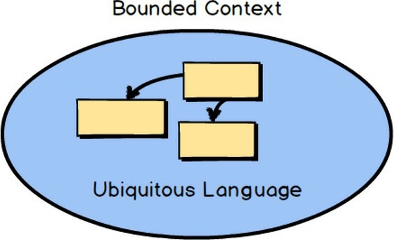
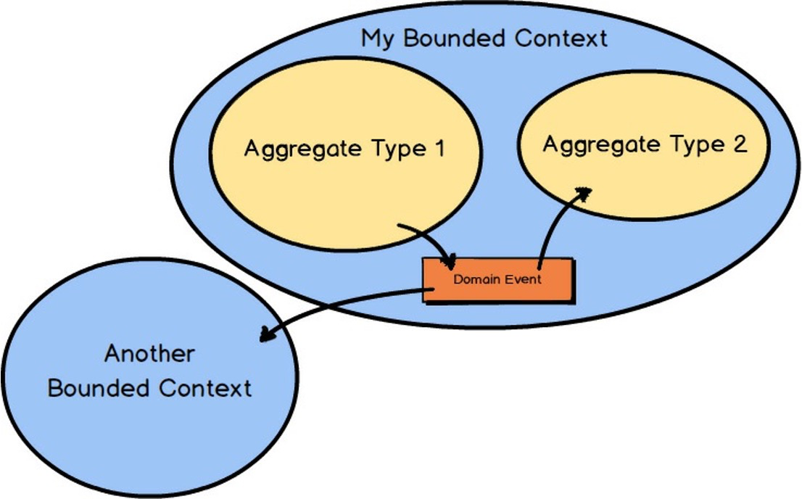

# 第一章 我的DDD 

你想提高你的手艺，增加你在项目上的成功。你渴望使用你创建的软件帮助你的企业在新的高度上竞争。你希望实施的软件的架构不仅能正确地模拟你的业务需求，而且能使用最先进的技术进行大规模的运作。学习`领域驱动设计`（DDD），并快速学习，可以帮助你实现所有这些目标，甚至更多。 

DDD是一套工具，协助你设计和实施在战略和战术上都能提供高价值的软件。你的组织不可能在所有方面都是最好的，所以它最好仔细选择它必须擅长的方面。DDD战略开发工具帮助你和你的团队为你的企业做出具有竞争力的最佳软件设计选择和集成决策。你的组织将从明确反映其核心竞争力的软件模型中获益最大。DDD战术开发工具可帮助您和您的团队设计有用的软件，准确模拟企业的独特运营。您的组织应受益于广泛的选择，可以在各种基础设施中部署其解决方案，无论是在内部还是在云中。有了DDD，你和你的团队可以成为在当今竞争激烈的商业环境中取得成功所需的最有效的软件设计和实施的人。 

在本书中，我为你提炼了DDD，浓缩了战略和战术建模工具的处理。我了解软件开发的独特需求，以及你在这个快节奏的行业中努力提高自己的技艺时所面临的挑战。你不可能总是花几个月的时间来阅读像DDD这样的主题，但你仍然希望尽快将DDD用于工作。 

我是畅销书《实施领域驱动设计》\[IDDD\]的作者，我还创建并教授为期三天的IDD研讨会。现在，我还写了这本书，以一种积极的浓缩形式带给你DDD。这都是我致力于将DDD带入每个软件开发团队的一部分，这也是它应得的地位。当然，我的目标也包括将DDD带给你。  

## DDD会不会造成伤害？ 
  

你可能听说过，DDD是一种复杂的软件开发方法。复杂吗？它当然不是复杂的必然结果。事实上，它是一套用于复杂软件项目的高级技术。由于其强大的功能和需要学习的内容，如果没有专家的指导，自己将DDD付诸实践可能会令人生畏。你可能也发现，其他一些DDD书籍有好几百页之多，远不容易消化和应用。为了给十几个DDD主题和工具提供详尽的实施参考，我需要大量的文字来解释DDD。这一努力导致了《实施领域驱动设计》\[IDDD\] 。提供这本浓缩的新书是为了让你尽可能快速简单地熟悉DDD的最重要部分。为什么？因为有些人被大部头的文字所淹没，需要一个精炼的指南来帮助他们采取最初的步骤来采用。我发现，那些使用DDD的人，会多次重温有关文献。事实上，你甚至可能得出结论，你永远都学不够，所以你会把这本书作为快速参考，并多次参考其他书以获得更多细节，因为你的技术已经得到完善。还有一些人在向他们的同事和最重要的管理团队推销DDD时遇到了困难。本书将帮助你做到这一点，不仅以简洁的形式解释了DDD，而且还展示了可用于加速和管理其使用的工具。 

当然，这本书不可能教你有关DDD的一切，因为我特意为你提炼了DDD技术。要想了解更深入的内容，请看我的书《实施领域驱动设计》\[IDDD\]，并考虑参加我为期三天的IDD研讨会。我在全球各地为数百名开发人员提供了为期三天的强化课程，帮助你迅速掌握DDD。我还提供DDD培训

> 在线网址：http://ForComprehension.com 

好消息是，DDD不一定会造成伤害。由于你可能已经在你的项目中处理了复杂性，你可以学习使用DDD来减少战胜复杂性的痛苦。 

## 好的，坏的和有效的设计 

通常人们会谈论好的设计和坏的设计。你做的是什么样的设计？许多软件开发团队甚至没有考虑过设计问题。相反，他们执行我称之为 "任务板洗牌"的做法。在这种情况下，团队有一个开发任务的清单，例如Scrum Backlog (产品积压)，他们把一张便条从看板的 "待办" 栏移到 "进行中"栏。想出积压项目和执行 "任务板洗牌" 构成了整个深思熟虑的洞察力，剩下的就交给程序员们的编码英雄主义来完成。这样的结果很少有可能是好的，而企业的成本通常是为这种不存在的设计付出的最高代价。 

这往往是由于在无情的时间表上交付软件版本的压力造成的，在这种情况下，管理层使用Scrum主要是为了控制时间表，而不是允许Scrum最重要的原则之一：知识获取。 

当我在个别企业做咨询或授课时，我通常会发现同样的情况。软件项目岌岌可危，整个团队被雇来维持系统的运行，每天修补代码和数据。以下是我发现的一些隐患，有趣的是，DDD可以随时帮助团队避免这些问题。我从更高层次的业务问题开始，然后转到更多的技术问题。 

- 软件开发被认为是一个成本中心，而不是一个利润中心。一般来说，这是因为企业将计算机和软件视为必要的麻烦，而不是战略优势的来源。不幸的是，如果企业文化被牢牢地固定下来，可能就没有办法解决这个问题了）。 
- 开发人员被技术缠身，试图用技术来解决问题，而不是仔细思考和设计。这导致开发人员不断追逐新的 "闪亮的东西"，也就是最新的技术潮流。 
- 数据库被赋予了太多的优先权，大多数关于解决方案的讨论都围绕着数据库和数据模型而不是业务流程和操作。
- 开发人员没有适当地强调根据业务目的来命名对象和操作。这导致了企业拥有的心理模型和开发人员提供的软件之间存在着巨大的鸿沟。 
- 前一个问题通常是与企业合作不力的结果。通常情况下，商业利益相关者在孤立的工作中花费了太多的时间，产生了没有人使用的规范，或者只有部分被开发人员所使用。 
- 项目估算的需求量很大，而且非常频繁地制作估算会增加大量的时间和精力，导致软件交付的延迟。开发人员使用 "任务板洗牌法" 而不是深思熟虑的设计。他们产生了一个大泥球（在下面的章节中讨论），而不是根据业务驱动力对模型进行适当的隔离。 
- 开发人员将业务逻辑置于用户界面组件和持久化组件中。另外，开发人员经常在业务逻辑中间进行持久化操作。
- 有破损、缓慢和锁定的数据库查询，阻碍了用户执行时间敏感的业务操作。 
- 有一些错误的抽象，开发人员试图通过过度概括的解决方案来解决所有当前和想象中的未来需求，而不是解决实际的具体业务需求。 
- 有一些强耦合的服务，在一个服务中执行一个操作，而这个服务直接调用另一个服务来引起一个平衡的操作。这种耦合常常导致业务流程的中断和数据的不协调，更不用说那些非常难以维护的系统了。 

这一切似乎都是本着 "没有设计就没有低成本的软件 "的精神进行的。而且很多时候，这只是一个企业和软件开发者不知道有一个更好的选择的问题。"软件正在吞噬世界"\[WSJ\]，对你来说，软件也可以吞噬你的利润，或者为你的利润提供盛宴，这一点应该很重要。 

重要的是要明白，想象中的 "无设计" 经济是一个谬论，它巧妙地愚弄了那些施加压力来生产软件而不进行深思熟虑的设计的人。这是因为设计仍然是从个别开发人员的大脑中流过他们的指尖，当他们与代码打交道的时候，没有来自其他人的任何输入，包括企业。我认为这句话很好地概括了这种情况。 

> 关于设计是否有必要或是否负担得起的问题是完全不重要的：设计是不可避免的。好的设计的替代品是坏的设计，而不是根本没有设计。 
— 书籍设计。道格拉斯-马丁著的《实用介绍》。 

尽管Martin先生的评论并不是专门针对软件设计的，但它们仍然适用于我们的手艺，在这里，周到的设计是不可替代的。在刚才描述的情况下，如果你有五个软件开发人员在做这个项目，那么 No Design实际上会产生五个不同设计的混合体。也就是说，你得到的是五种不同的商业语言的混合解释，这些解释是在没有真正的领域专家的帮助下开发的。 

底线是：无论我们是否承认建模，我们都要进行建模。这可以比喻为道路是如何发展的。一些古老的道路一开始是车行道，最终被塑造成了磨损严重的小路。他们走了一些莫名其妙的弯路，并制造了一些岔路，只为一些有基本需求的人服务。在某些时候，这些道路被磨平，然后被铺设，以方便越来越多的旅行者使用它们。这些临时性的大道在今天并不是因为设计得好而被旅行，而是因为它们的存在。我们同时代的人中，很少有人能理解为什么走其中的一条会如此不舒服和不方便。现代道路是根据对人口、环境和可预测流量的仔细研究来规划和设计的。这两种道路都是有模型的。一个模型采用了最小的、基础的智力。另一个模型则利用了最大的认知。软件可以从任何一个角度进行建模。 

如果你害怕生产具有深思熟虑的设计的软件是很昂贵的，那么请想一想要忍受甚至修复一个糟糕的设计会有多昂贵。当我们谈论的是需要将你的组织与所有其他组织区分开来并产生相当大的竞争优势的软件时，情况更是如此。 

与 "好 "密切相关的一个词是 "有效"，它可能更准确地描述了我们应该做的事情。

在软件设计中，我们要争取的是：有效的设计。有效的设计能够满足企业组织的需要，使其通过软件的方式在竞争中脱颖而出。有效的设计迫使企业了解它必须擅长的东西，并用来指导创建正确的软件模型。 

在Scrum中，知识的获取是通过实验和协作学习完成的，被称为 "购买信息" \[Essential Scrum\] 。**知识从来不是免费的**，但在这本书中，我确实为你提供了加速获得知识的方法。 

如果你仍然怀疑有效的设计很重要，不要忘了一个似乎已经明白其重要性的人的见解。 

> 大多数人犯了一个错误，认为设计就是它的样子。人们认为它是一种外衣--设计师被交给这个盒子，然后被告知："让它看起来不错！" 
> 这并不是我们所认为的设计。它不仅仅是它看起来像什么，感觉像什么。设计是它是如何工作的。 
—— 史蒂夫-乔布斯 

在软件方面，有效的设计是最重要的。鉴于只有一种选择，我推荐有效的设计。 

  

## 战略设计 

我们从最重要的战略设计开始。除非你从战略设计开始，否则你真的无法有效地应用战术设计。战略设计的使用就像在进入实施细节之前的大笔画。它强调了什么对你的企业具有战略意义，如何按重要性进行分工，以及如何根据需要进行最佳整合。 

首先，你将学习如何使用被称为 "受限上下文 "的战略设计模式来隔离你的领域模型。手拉手，你将看到如何在一个明确的有边界的上下文中开发一个泛在语言作为你的领域模型。 

你将了解到在你开发你的模型的泛在语言时，不仅要与开发人员而且要与领域专家接触的重要性。你将看到一个由软件开发人员和领域专家组成的团队是如何协作的。这是DDD产生最佳结果所需的聪明而积极的人的重要组合。你们通过协作共同开发的语言将成为无处不在、无孔不入的语言，贯穿团队的口语交流和软件模型。

随着你对战略设计的进一步深入，你将了解到子域，以及这些子域如何帮助你处理遗留系统的无限制的复杂性，以及如何提高你在绿地项目上的成果。你还会看到如何使用一种叫做 "上下文映射" 的技术来整合多个 "有界上下文"。语境图定义了两个整合的Bounded Contexts之间存在的团队关系和技术机制。 

  

## 战术设计 

在我给你打下了战略设计的良好基础之后，你将发现DDD最突出的战术设计工具。战术设计就像用细笔画出领域模型的细部。其中一个比较重要的工具是用来将实体和价值对象聚合在一起，形成一个大小合适的集群。这就是`聚合模式`（Aggregate pattern）。 

DDD是指以尽可能明确的方式对你的领域进行建模。使用领域事件将帮助你明确地建模，并与需要了解的系统分享你的模型中所发生的事情。有关各方可能是你自己的本地边界上下文和其他远程边界上下文。

  

## 学习过程和完善知识 

DDD传授一种思维方式，帮助你和你的团队在了解企业核心竞争力的过程中完善知识。这个学习过程是通过小组对话和实验来发现问题。通过质疑现状和挑战你对软件模型的假设，你会学到很多东西，而这种最重要的知识获取将在整个团队中传播。这是对你的企业和团队的一项重要投资。我们的目标不仅是学习和完善，而且是尽快学习和完善。有一些额外的工具可以帮助实现这些目标，这些工具可以在[第七章](DDD-D-07.md)"加速和管理工具" 中找到。 

## 让我们开始吧! 

即使在一个浓缩的演讲中，也有很多关于DDD的知识。因此，让我们从第二章，"有边界上下文和泛在语言的战略设计" 开始吧。