# 第二章、有界上下文和泛在语言的战略设计 

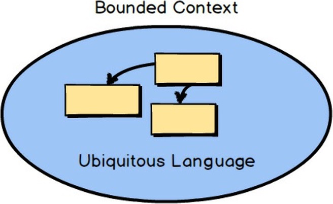  

这些被称为 "有界上下文 (Bounded Contexts)"的东西是什么？什么是"泛在语言" (Ubiquitous Language)？简而言之，DDD主要是在一个明确的`有界上下文`中对`泛在语言`进行建模。虽然这是事实，但这可能不是我所能提供的最有用的描述。让我为你分解一下。 

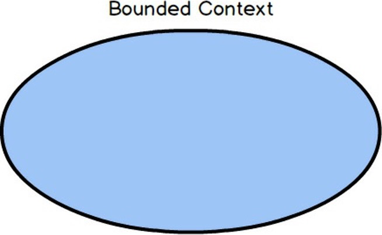  

首先，"有界上下文 "是一个语义上的边界。这意味着在这个边界内，软件模型的每个组件都有特定的含义，并做特定的事情。`Bounded Context` 里面的组件是针对上下文的，是有语义动机的。这就很简单了。 

当你刚刚开始你的软件建模工作时，你的Bounded Context在某种程度上是概念性的。你可以把它看作是你`问题空间`的一部分。然而，当你的模型开始具有更深的意义和清晰度时，你的Bounded Context将迅速过渡到你的`解决方案空间`，你的软件模型将反映为项目源代码。(`问题空间`和`解决方案空间`在盒子里有更好的解释。)记住，一个Bounded Context是一个模型被实现的地方，你将为每个Bounded Context有单独的软件工件。 

	什么是问题空间和解决方案空间？
	
	你的问题空间是你在一个特定项目的约束条件下进行高层次的战略分析和设计步骤的地方。你可以使用简单的图表，因为你讨论的是高层次的项目驱动因素，并注意到重要的目标和风险。在实践中，情境图在问题空间中工作得非常好。还要注意的是，在需要时，Bounded Contexts可以用于问题空间的讨论，但也与你的解决方案空间密切相关。
	
	你的解决方案空间是你实际实施解决方案的地方，你的问题空间讨论确定为你的核心领域。当 "有界背景" 被开发为你的组织的关键战略举措时，它被称为核心领域。你在Bounded Context中开发的解决方案是代码，包括主源和测试源。你也将在你的解决方案空间中产生代码，支持与其他边界上下文的集成。 

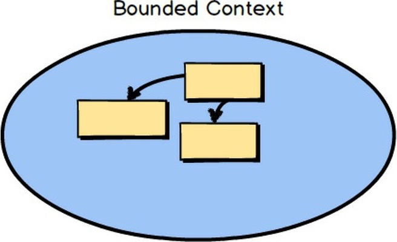  

边界内的软件模型反映了一种语言，这种语言是由在边界内工作的团队开发的，并且由团队的每个成员说出来，这些成员创造了在边界内发挥作用的软件模型。这种语言被称为`泛在语言`，因为它既在团队成员之间说，又在软件模型中实现。因此，泛在语言必须是严格的：严格的、精确的、严格的和紧凑的。在图中，Bounded Context里面的方框代表了模型的概念，这些概念可以被实现为类。当 "有界上下文 "作为你的组织的关键战略举措被开发时，它被称为`核心领域`。 

与你的组织所使用的所有软件相比，核心域是一种软件模型，它属于最重要的模型，因为它是实现伟大的手段。一个核心领域的开发是为了使你的组织在竞争中区别于所有其他组织。至少，它涉及一个主要的业务领域。你的组织不可能在所有方面都表现出色，甚至不应该尝试。因此，你要明智地选择什么应该成为你的核心领域的一部分，什么不应该。这是DDD的主要价值主张，你希望通过将最好的资源投入到核心领域中来进行适当的投资。
  

当团队中有人使用泛在语言的表达方式时，团队中的每个人都能准确地理解其含义和约束。这种表达方式在团队中是无处不在的，正如团队所使用的定义正在开发的软件模型的所有语言一样。 

当你考虑软件模型中的语言时，想想组成欧洲的各个国家。在这个空间中的一个国家内，每个国家的官方语言是明确的。在这些国家的边界内--例如，德国、法国和意大利，官方语言是确定的。当你跨越边界时，官方语言就会改变。亚洲的情况也是如此，在日本使用日语，而在中国和韩国使用的语言在国境线上明显不同。你可以用同样的方式来思考 "有界语境"（Bounded Contexts），它是语言的边界。在DDD的案例中，语言是拥有软件模型的团队所使用的语言，而语言的一个明显的书面形式是软件模型的源代码。 

	有界限的背景、团队和源代码库

	应该有一个团队负责一个Bounded Context的工作。每个Bounded Context也应该有一个单独的源代码库。一个团队有可能在多个 "有界背景 "上工作，但多个团队不应该在一个 "有界背景 "上工作。将每个Bounded Context的源代码和数据库模式干净地分开，就像你分开Ubiquitous语言一样。将验收测试和单元测试与主源代码放在一起。 

	特别重要的是，要明确一个团队在一个单一的Bounded Context上工作。这完全消除了当另一个团队对你的源代码进行修改时出现任何不受欢迎的意外的机会。你的团队拥有源代码和数据库，并定义了官方接口，你的Bounded Context必须通过这些接口来使用。这是使用DDD的一个好处。

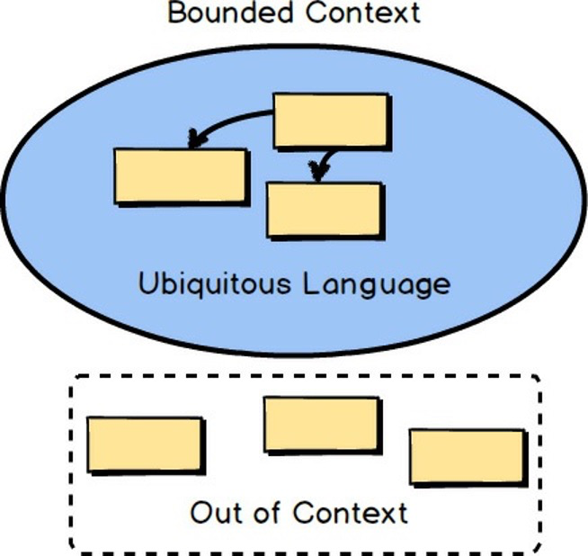  

在人类的语言中，术语随着时间的推移而演变，在不同的国界，相同或相似的词语会有细微的含义。想想在西班牙使用的西班牙语词汇和在哥伦比亚使用的相同词汇之间的差异，甚至连发音都有变化。显然有西班牙的西班牙语和哥伦比亚的西班牙语。软件模型语言也是如此。其他团队的人有可能对相同的术语有不同的含义，因为他们的业务知识是在不同的上下文中；他们正在开发不同的Bounded Context。上下文之外的任何组件都不会被期望遵守相同的定义。事实上，它们很可能与你的团队所建模的组件有细微或巨大的不同。这很好。 

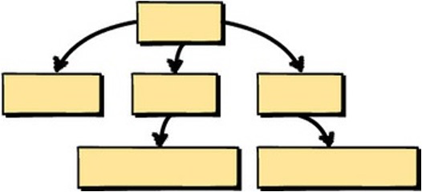  

为了理解使用Bounded Contexts的一个重要原因，让我们考虑软件设计中的一个常见问题。通常，团队不知道什么时候应该停止在他们的领域模型中堆积越来越多的概念。这个模型开始时可能很小，也很容易管理。

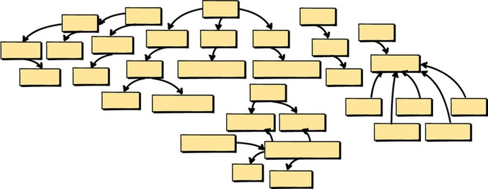  

但随后团队增加了更多的概念，还有更多，仍然更多。这很快就造成了一个大问题。不仅有太多的概念，而且模型的语言也变得模糊不清，因为当你想一想，在一个大的、混乱的、无界限的模型中实际上有多种语言。 

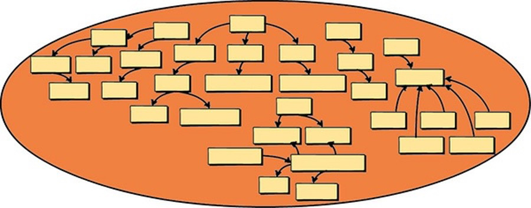  

由于这个错误，团队往往会把一个全新的软件产品变成所谓的大泥球。可以肯定的是，"大泥球 "不是什么值得骄傲的东西。它是一个单体，而且更糟。这是指一个系统有多个纠结的模型，没有明确的界限。它可能还需要多个团队来进行工作，这是很有问题的。此外，各种不相关的概念在许多模块中被吹得天花乱坠，并与相互冲突的元素相互联系。如果这个项目有测试，可能需要很长的时间来运行它们，所以测试可能在特别重要的时候被绕过。 

这是试图在错误的地方和太多的人做太多事情的产物。任何试图发展和讲一种无所不在的语言的行为都会导致一种支离破碎、定义不清的方言，很快就会被抛弃。这种语言甚至不会像世界语那样构思精巧。它只是一团糟，像一个大泥球。

  

## 领域专家和商业驱动力 

商业利益相关者可能会有强烈的，或者至少是微妙的暗示，这些暗示本可以用来帮助技术团队做出更好的建模选择。因此，一个大泥球往往是由不听业务专家意见的软件开发人员团队肆意妄为的结果。 

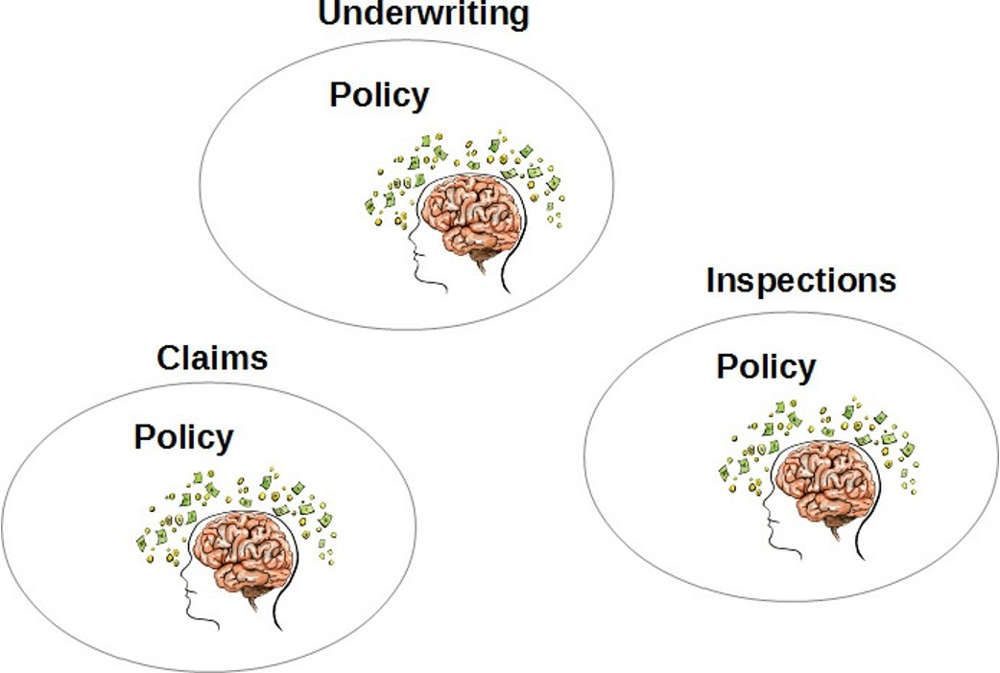  

企业的部门或工作小组的划分可以很好地说明模型的边界应该存在于哪里。你往往会发现每个业务职能部门至少有一个业务专家。最近，有一种趋势是按项目分组，而业务部门甚至管理层次下的职能组似乎不太受欢迎。即使面对较新的商业模式，你仍然会发现，项目是根据业务驱动力来组织的，并在一个区域内的专业知识。你可能需要从这些方面来考虑部门或职能。 

当你考虑到每个业务职能部门很可能对同一术语有不同的定义时，你就可以确定这种隔离是必要的。考虑一下名为 "保单 "的概念，以及它在各种保险业务职能中的含义是如何不同的。你可以很容易地想象到核保中的政策与索赔中的政策和检查中的政策有很大不同。更多细节见方框。 

每个业务领域的政策都有不同的存在理由。这个事实是无法回避的，再多的精神体操也无法改变这一点。 

	不同职能的政策差异 

	核保中的政策。在专注于核保的专业领域，保单是根据对被保险实体的风险评估而制定的。例如，在从事财产保险的核保工作时，核保人员会评估与特定财产相关的风险，以计算保单的保费，从而为财产资产提供保障。 

	检查方面的政策。同样，如果我们在财产保险领域工作，保险机构可能会有一个专业的检查领域，负责检查将要投保的财产。承保人在一定程度上依赖于检查过程中发现的信息，但只是从财产处于被保险人所声称的状态的角度来看。假设财产将被投保，检查的细节--照片和笔记--将与检查区的保单相关联，其数据可以被核保人员参考，以协商核保区的最终保费成本。 

	索赔方面的政策。理赔专业领域的政策是根据核保领域制定的政策条款，跟踪被保险人的付款要求。理赔政策需要参考承保政策，但重点在于，例如，对被保险财产的损害和理赔人员进行的审查，以确定应支付的款项（如有）。 

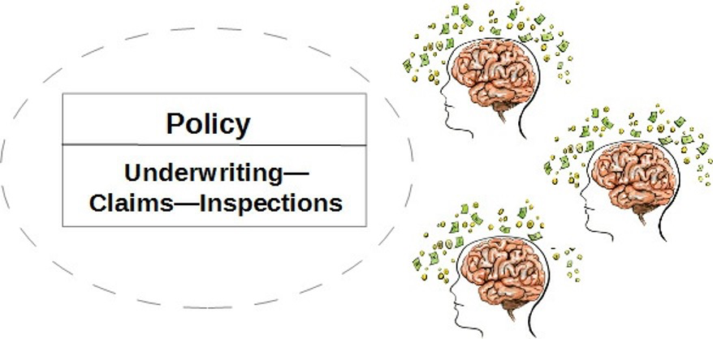  

如果你试图将所有这三种政策类型合并成一个针对所有三个业务组的单一政策，你肯定会有问题。这将变得更有问题，如果已经超载的政策不得不在未来支持第四和第五个商业概念。没有人是赢家。

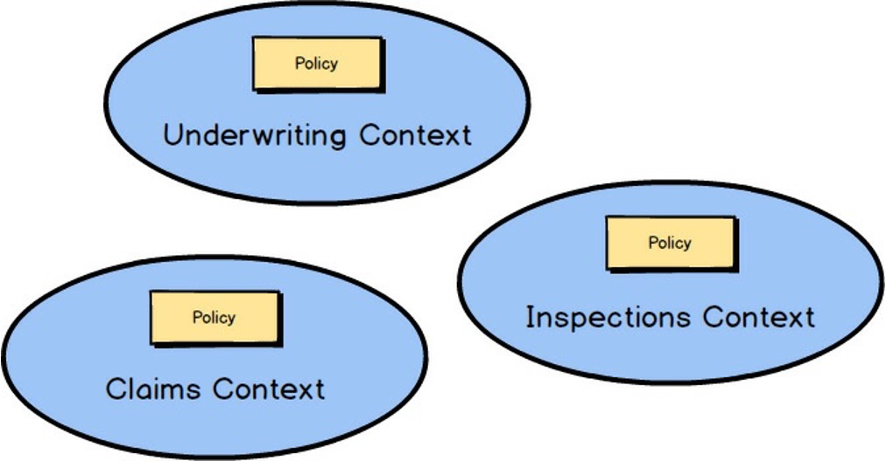  

另一方面，DDD强调通过隔离不同的类型来拥抱这种差异纳入不同的有边界的背景。承认有不同的语言，并相应地发挥作用。政策有三种含义吗？那么就有三个Bounded Contexts，每个都有自己的政策，每个政策都有自己独特的品质。没有必要将这些命名为 UnderwritingPolicy , ClaimsPolicy , 或InspectionsPolicy。Bounded Context的名称可以解决这个问题。在所有三个边界上下文中，名称都是简单的 Policy。 

	另一个例子。什么是航班？ 

	在航空业，"飞行 "可以有多种含义。有一种飞行被定义为一次起飞和降落，飞机从一个机场飞到另一个机场。有一种不同的飞行被定义为飞机维修。还有一种飞行是以旅客购票的方式来定义的，可以是不停站，也可以是一站式。因为 "飞行 "的每一种用途都只能通过其上下文来清楚地理解，所以每一种用途都应该在一个单独的 "有界上下文 "中进行建模。在同一个 "受限上下文 "中对所有这三种情况进行建模，会导致混乱的纠结。

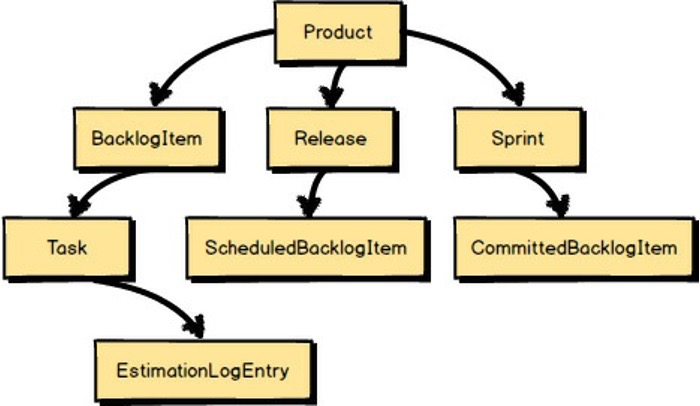  

## 案例研究 

为了使使用Bounded Contexts的理由更加具体，让我用一个示例领域模型来说明。在这种情况下，我们正在开发一个基于Scrum的敏捷项目管理应用。因此，一个中心或核心的概念是产品，它代表了将要建立的软件，并且可能会在几年的开发过程中得到完善。产品有积压项目、发布和冲刺。每个积压项目都有一些任务，每个任务都可以有一个估算日志条目的集合。发布版有预定的积压项目，而Sprints有承诺的积压项目。到目前为止，一切都很好。我们已经确定了我们领域模型的核心概念，而且语言是集中的、完整的。 

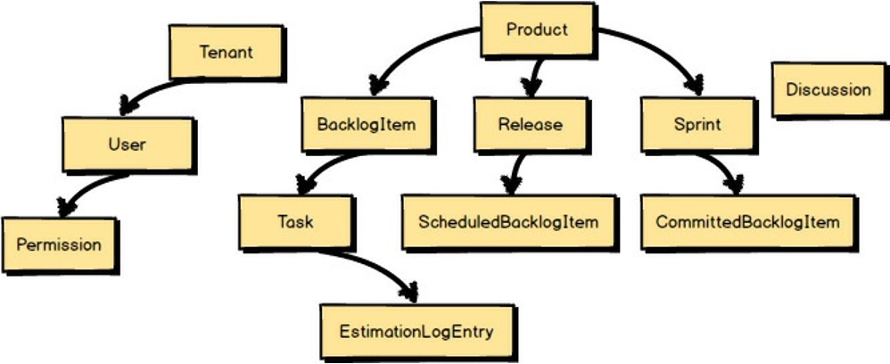  

"哦，是的，"团队成员说，"我们也需要我们的用户。而且我们想促进产品团队内部的协作讨论。让我们把每个订阅的组织表示为一个租户。在租户中，我们将允许注册任何数量的用户，而用户将拥有权限。让我们添加一个叫做 "讨论 "的概念，以代表我们将支持的协作工具之一。

然后团队成员补充说，"嗯，还有其他的协作工具。讨论属于论坛内，讨论有帖子。另外，我们还想支持共享日历"。 

他们继续说。"别忘了，我们需要一个让租户付款的方法。我们还将出售分层支持计划，所以我们需要一种方法来跟踪支持事件。支持和付款都应该在一个账户下管理。" 

而且还出现了更多的概念。"每个基于Scrum的产品都有一个特定的团队，在产品上工作。团队由一个产品负责人和一些团队成员组成。但是，我们怎样才能解决人力资源利用的问题呢？嗯，如果我们把团队成员的时间表以及他们的利用率和可用性？"

"你知道还有什么吗？"他们问。"共享日历不应局限于平淡的日历条目。我们应该能够识别特定种类的日历条目，如提醒、团队里程碑、计划和回顾性会议以及目标日期。" 

等一下！你看到这个团队正在落入的陷阱了吗？看看他们已经偏离了产品、Backlog项目、发布和Sprints这些最初的核心概念有多远。语言不再是纯粹的Scrum；它已经变得支离破碎，混乱不堪。 

不要被数量有限的命名概念所迷惑。对于每一个被命名的元素，我们可能期望有两到三个更多的概念来支持那些迅速跳入脑海的元素。这个团队已经在提供一个大泥球的路上了，而这个项目才刚刚开始。

## 需要基本的战略设计 

DDD有哪些工具可以帮助我们避免这种陷阱？你至少需要两个基本的战略设计工具。一个是 "有边界的背景"，另一个是 "无所不在的语言"。采用 "受限背景 "迫使我们回答 "什么是核心 "的问题。边界语境应该紧紧抓住所有对战略举措具有核心意义的概念，并将所有其他概念排除在外。留下的概念是团队泛在语言的一部分。你将看到DDD是如何工作的，以避免设计单片式的应用程序。 

	测试的好处 

	因为Bounded Contexts不是单一的，所以当它们被使用时还会有其他好处。其中一个好处是，测试将集中在一个模型上，因此数量较少，运行速度较快。虽然这不是使用Bounded Contexts的主要动机，但它肯定会在其他方面得到回报。 

从字面上看，一些概念将在上下文中出现，并明确包含在团队的语言中。

而其他概念则会脱离上下文。在这种严格的只对核心进行过滤的应用中幸存下来的概念是拥有约束性语境的团队的泛在语言的一部分。 

	注意事项 

	在这种严格的只对核心进行过滤的应用中幸存下来的概念是拥有边界语境的团队的泛在语言的一部分。边界强调了内部的严谨性。 

那么，我们如何知道什么是核心？这就是我们必须把两组重要的人聚在一起，组成一个有凝聚力的合作团队。领域专家和软件开发人员。

领域专家自然会更关注商业问题。他们的想法将以他们对业务如何运作的看法为中心。在Scrum领域，领域专家是一个彻底了解Scrum在项目中的执行方式的Scrum Master。 

	产品负责人还是领域专家？ 

	你可能想知道Scrum产品负责人和DDD领域专家之间有什么区别。好吧，在某些情况下，他们可能是同一个人，也就是说，一个人可以胜任这两个角色。然而，产品负责人通常更专注于管理和优先处理产品积压，并确保项目的概念和技术连续性，这一点并不令人惊讶。然而，这并不意味着产品负责人天生就是你所从事的业务核心竞争力方面的专家。请确保你的团队中有一个真正的领域专家，不要用一个没有必要的技术知识的产品负责人来代替。 

在你的特定业务中，你也有领域专家。这不是一个工作头衔，而是描述那些主要关注业务的人。我们从他们的心理模型入手，形成团队泛在语言的基础。

另一方面，开发人员专注于软件开发。正如这里所描述的，开发人员可能会被编程语言和技术所吞噬。然而，在DDD项目中工作的开发者需要谨慎地抵制以技术为中心的冲动，以免他们无法接受核心战略举措的业务重点。相反，开发者应该拒绝任何不需要的迟钝，并能够接受团队在其特定的 "边界环境 "中逐步开发的泛在语言。 

	关注业务的复杂性，而不是技术的复杂性 

	你之所以使用DDD，是因为业务模型的复杂性很高。我们从来不想让领域模型变得比它应该有的更复杂。不过，你之所以使用DDD，是因为业务模型比项目的技术方面更复杂。这就是为什么开发人员必须与领域专家一起深入研究业务模型的原因!

开发者和领域专家都应该拒绝任何让文档统治对话的倾向。最好的泛在语言将由一个合作的反馈循环来开发，它将推动团队的综合心理模型。公开对话、探索和对你目前的知识基础的挑战导致了对核心领域更深的洞察力。 

## 挑战和统一 

现在回到 "什么是核心 "的问题上？利用以前失控和不断扩大的模式，让我们来挑战和统一! 

一个非常简单的挑战是问每个大模型的概念是否遵守了Scrum的通用语言。那么，它们有吗？例如，租户、用户和许可与Scrum毫无关系。这些概念应该从我们的Scrum软件模型中剔除。

租户、用户和权限应该被团队、产品所有者和团队成员所取代。ProductOwner和TeamMember实际上是租户中的用户，但对于ProductOwner和TeamMember，我们坚持Scrum的泛在语言。当我们就Scrum产品和团队的工作进行对话时，它们自然是我们使用的术语。 

SupportPlans和Payments真的是Scrum项目管理的一部分吗？这里的答案显然是 "不"。的确，SupportPlans和Payments都将在租户的账户下进行管理，但是这些并不是我们核心Scrum语言的一部分。它们脱离了上下文，是从这个模型中删除。

引入人力资源利用的关注呢？它可能对某人有用，但它不会被将在BacklogItemTasks上工作的TeamMember Volunteers直接使用。这已经脱离了背景。 

在增加了团队、产品拥有者和团队成员之后，建模者意识到他们缺少一个核心概念来允许团队成员在任务上工作。在Scrum中，这就是

因此，志愿者的概念是有背景的，并被纳入核心模型的语言中。 

尽管基于日历的里程碑、回顾和类似的东西都在上下文中，但团队更愿意把这些建模工作留到以后的冲刺阶段。他们是有背景的，但现在他们已经超出了范围。 

最后，建模者想确保他们考虑到线程讨论将是核心模型的一部分这一事实。所以他们建立了一个讨论模型。这意味着讨论是团队的泛在语言的一部分，因此是在受限语境中。

这些语言上的挑战导致了一个更干净、更清晰的泛在语言模型。然而，Scrum模型将如何实现所需的讨论？它肯定需要大量的辅助软件组件支持来实现，所以似乎不适合建立模型 

在我们的Scrum Bounded Context里面。事实上，完整的协作套件已经脱离了上下文。讨论将通过与另一个Bounded Context\--Collaboration Context的整合来支持。 

经过这次走访，我们留下了一个更小的实际核心域。当然，核心领域还会增长。我们已经知道，计划、回顾、里程碑和相关的基于日历的模型必须及时开发。不过，这个模型只会随着新的 

这些概念遵循了Scrum的通用语言。

那么，所有被从核心域中删除的其他建模概念呢？很有可能，其他几个概念，如果不是全部的话，将被组成它们各自的Bounded Contexts，每个都遵守它自己的Ubiquitous语言。稍后你会看到我们如何使用上下文映射与它们整合。 

## 开发一种无所不在的语言 

那么，当你将DDD提供的主要工具之一付诸实践时，你如何在你的团队中实际开发一种泛在语言？你的泛在语言是由一组著名的名词组成的吗？名词是很重要的，但软件开发人员往往过于强调在一个领域模型中的名词，忘记了口语是由远远超过名词组成的。诚然，到目前为止，我们主要关注的是在我们之前的样本Bounded Contexts中的名词，但那是因为我们对DDD的另一个方面感兴趣，即把核心域约束到基本的模型元素。 

	加快你的发现 

	你可能想在你的情景工作中尝试一些事件风暴会议。这可以帮助你迅速了解你应该在哪些情景下工作，以及如何确定它们的优先次序。同样，制定具体的方案将使你更好地了解你在 "事件风暴 "会议中应该采取的方向。它们是两个配合良好的工具。我在第七章 "加速和管理工具 "中解释了事件风暴的使用。 

不要把你的核心域仅仅局限于名词。相反，考虑将你的核心领域表达为一组关于领域模型应该做什么的具体情景。当我说 "场景 "时，我并不是指用例或用户故事，比如在软件项目中常见的那样。我的意思是在领域模型应该如何工作方面的情景--各种组件做什么。只有通过领域专家和开发人员的团队合作，才能以最彻底的方式完成这项工作。 

下面是一个符合Scrum泛在语言的场景的例子。 

	允许每个积压项目被提交给一个冲刺。只有当积压的项目已经被安排发布时，才可以提交。如果它已经被提交到不同的冲刺阶段，必须先取消提交。当提交完成后，通知相关各方。 

注意，这不仅仅是一个关于人类如何在项目中使用Scrum的场景。我们不是在谈论人类的程序。相反，这个场景是对非常真实的软件模型组件如何被用来支持基于Scrum的项目的管理的描述。 

前面的场景并不是一个完美的陈述，使用DDD的一个好处是我们会不断地寻找改进模型的方法。然而，这是一个很好的开始。我们听到的是名词，但我们的情景并不局限于名词。我们还听到动词和副词，以及其他种类的语法。你还听到有一些约束条件--在情景完成到成功结束之前必须满足的条件。最重要的好处和授权功能是，你实际上可以就领域模型如何工作--它的设计进行对话。 

我们甚至可以绘制简单的图片和图表。这都是为了在团队中做好沟通而做的事情。在这里，有一个警告词是合适的。在你的领域建模工作中，当涉及到保持有书面方案的文件和图画及图表的长期更新时，要谨慎对待所花费的时间。这些东西并不是领域模型。相反，它们只是帮助你开发领域模型的工具。最后，代码就是模型，模型就是代码。仪式是用于尊贵的纪念活动，如婚礼，而不是领域模型。这并不意味着你要放弃任何刷新场景的努力，但只要是有帮助的，而不是有负担的，就可以这样做。 

在我们之前的例子中，你会怎么做来改进优生优育语言的一部分？请想一想，就一分钟。缺少什么呢？在不久之前，你可能希望了解谁在冲刺阶段提交积压项目的情况。让我们加入谁，看看会发生什么。 

> 产品所有者将每个积压项目提交给一个冲刺 ......。 

你会发现，在很多情况下，你应该为情景中涉及的每个角色命名，并为其他概念赋予一些区别属性，如积压项目和冲刺。这将有助于使你的方案更加具体，而不像一组关于验收标准的声明。不过，在这个特殊的案例中，并没有强烈的理由去命名产品所有者或进一步描述所涉及的积压项目和冲刺。在这种情况下，所有的产品所有者、积压项目和冲刺的工作方式都是一样的，无论他们是否有具体的角色或身份。如果给场景中的概念起名字或其他区别性身份有帮助的话，就使用它们。 

产品负责人Isabel将 "查看用户资料 "的积压项目提交到 "交付用户资料 "冲刺阶段。 

现在让我们停顿一下。这并不是说产品所有者是唯一负责决定一个积压项目将被提交到冲刺阶段的人。Scrum团队不会很喜欢这样，因为他们将致力于在一些他们没有决定权的时间范围内交付软件。尽管如此，对于我们的软件模型来说，由一个人负责负责在模型上执行这个特定的行动。所以在这种情况下，我们已经说明是产品负责人的角色在做这件事。即便如此，Scrum团队的性质还是迫使我们提出这样的问题："是否有什么事情必须由团队的其余成员来完成，以使产品所有者能够履行承诺？" 

你看到发生了什么吗？通过用 "谁 "的问题来挑战当前的模式，我们被引导到了一个深入了解该模式的机会。也许我们应该在允许产品负责人执行提交操作之前，至少要求团队对积压项目的提交达成一些共识。这可能会导致以下的改进方案。 

> 产品所有者将一个积压项目提交给一个冲刺。只有当积压的项目已经安排好发布，并且团队成员中的法定人数已经批准承诺时，才可以提交。. . 

好了，现在我们有一个完善的泛在语言，因为我们已经确定了一个新的模型概念，叫做法定人数。我们决定，必须有一个同意积压项目应该被承诺的团队成员的法定人数，而且必须有一种方法让他们批准承诺。现在这已经引入了一个新的建模概念和一些想法，用户界面将必须促进这些团队互动。你看到创新的展开了吗？ 

模型中还缺少一个人。哪一个呢？我们的开场白结束了。当提交完成后，通知有关各方。 

谁或什么是有关各方？这个问题和挑战进一步导致了建模的洞察力。谁需要知道一个积压项目何时被提交到冲刺阶段？其实一个重要的模型元素就是冲刺本身。冲刺需要跟踪总的冲刺承诺，以及交付所有冲刺的任务已经需要哪些努力。无论你决定如何设计冲刺来跟踪，现在重要的一点是，当一个积压项目被提交给冲刺时，冲刺要得到通知。 

如果它已经承诺到不同的冲刺阶段，必须先取消承诺。当承诺完成后，通知未承诺的冲刺和现在承诺的冲刺。 

现在我们有了一个相当体面的领域场景。这个结论句也让我们了解到，积压项目和冲刺不一定同时意识到承诺。我们需要询问业务来确定，但这听起来是一个引入最终一致性的好地方。你会看到为什么这一点很重要，以及如何在第5章，"用聚合体进行战术设计 "中完成。 

完善后的方案整体上看起来是这样的。 

> 产品所有者将一个积压项目提交给一个冲刺。只有当积压项目已经被安排发布，并且有足够的团队成员认可时，才可以被提交。如果该项目已经被提交到不同的冲刺阶段，则必须先取消提交。当承诺完成后，通知未承诺的冲刺和现在已承诺的冲刺。 

一个软件模型在实践中究竟会如何运作？你完全可以想象一个非常创新的用户界面来支持这个软件模型。当一个Scrum团队正在参与冲刺计划时

会议中，团队成员使用他们的智能手机或其他移动设备，在讨论并同意在下一个冲刺阶段开展工作时，对每个积压项目添加他们的批准。团队成员在批准每个积压项目时达成的共识，使产品负责人能够将所有批准的积压项目提交给冲刺阶段。 

## 将方案付诸实施 

你可能想知道如何才能从书面方案过渡到某种工件，用来对照团队的规范来验证你的领域模型。有一种名为Specification by Example\[规范\]的技术可以使用；它也被称为Behavior-Driven Development\[BDD\] 。通过这种方法，你要实现的是合作开发和完善一个具有共同理解的Ubiquitous语言、模型，并确定你的模型是否符合你的规范。你将通过创建验收测试来做到这一点。下面是我们如何将前面的情景重述为可执行的规范。 

(点击这里查看代码图片)

	情景： 

	产品所有者将一个积压项目提交给一个冲刺阶段 
	给出一个预定要发布的积压项目
	以及该积压项目的产品负责人
	和承诺的冲刺 
	以及团队批准承诺的法定人数
	当产品所有者将积压项目提交给冲刺时
	然后，积压项目被提交到冲刺阶段。 
	并且创建了积压项目承诺事件 

有了以这种形式编写的场景，你可以创建一些支持代码，并使用一个工具来执行这个规范。即使没有工具，你也会发现这种形式的场景编写及其给定/何时/何时的方法比之前的场景编写例子更有效。然而，作为验证领域模型的一种手段，执行你的规范可能是难以抗拒的。我将在第7章 "加速和管理工具 "中进一步评论这个问题。 

你不必使用这种形式的可执行规范来验证你的领域模型与你的场景。你可以使用单元测试框架来完成同样的事情，你可以创建验收测试（不是单元测试）来验证你的领域模型。 

（点击这里查看代码图片） 

	产品所有者将一个积压项目提交给一个冲刺。 
	积压的项目只有在它已经是 
	预定发布，如果团队成员达到法定人数 
	已批准的承诺。当承诺完成后。 
	通知它现在所承诺的冲刺。 

	\[测试\] 

	public void ShouldCommitBacklogItemToSprint（）。 

	{ 

	// 鉴于 

	var backlogItem = BacklogItemScheduledForRelease（）。 

	var productOwner = ProductOwnerOf(backlogItem);

	var sprint = SprintForCommitment（）。 

	var quorum = QuorumOfTeamApproval(backlogItem, sprint); 

	// 当 

	backlogItem.CommitTo(sprint, productOwner, quorum)。 

	然后 

	Assert.IsTrue(backlogItem.IsCommitted())。 

	var backlogItemCommitted = 

	backlogItem.Events.OfType<BacklogItemCommitted>（）.SingleOrDefault（）。 

	Assert.IsNotNull（backlogItemCommitted）。 

	} 

这种基于单元测试的验收测试方法完成了与可执行规范相同的目标。这里的优势可能是能够更快速地编写这种场景验证，但要以牺牲一些可读性为代价。尽管如此，大多数领域专家应该能够在开发人员的帮助下遵循这种代码。当使用这种方法时，最好的办法是在注释中保持与验证代码相关的场景的文档形式，如本例所示。 

无论你决定采用哪种方法，通常都会以红-绿（失败-通过）的方式来使用，你的规范在运行时首先会失败，因为没有领域模型概念的实现需要验证。你通过一系列的红色结果逐步完善你的领域模型，直到你完全支持你的规范并且验证通过（你看到的都是绿色）。这些验收测试将与你的Bounded Context直接关联，并保存在其源代码库中。 

## 长途跋涉怎么办？ 

现在你可能想知道，一旦创新停止，维护开始，我们应该如何支持泛在语言。实际上，一些最好的学习或知识获取是在很长一段时间内进行的，甚至是在一些人所说的 "维护 "期间。如果团队认为创新在维护开始时就结束了，那是一个错误。 

也许最糟糕的事情是，"维持阶段 "的标签被贴在一个核心领域上。一个持续的学习过程根本就不是一个阶段。随着时间的推移，早期开发的泛在语言必须继续茁壮成长。的确，它最终可能不那么重要了，但可能在相当长的一段时间内不会。这都是你的组织对一个核心倡议的承诺的一部分。如果不能做出这种长期的承诺，你今天所做的这个模型是否真的是一个战略上的差异化因素，一个核心领域？

## 架构 

还有一个问题，你可能已经想知道了。Bounded Context里面有什么？使用这个端口和适配器\[IDDD\]架构图，你可以看到Bounded Context不仅仅由一个领域模型组成。 

这些层在Bounded Context中是很常见的。输入适配器，如用户界面控制器、REST端点和消息监听器；协调用例和管理事务的应用服务；我们一直关注的领域模型；以及输出适配器，如持久性管理和消息发送器。关于这个架构中的各个层，有很多东西要讲，在这本精炼的书中无法阐述。请参阅《实现领域驱动设计》\[IDDD\]的第四章，了解详尽的讨论。 

	技术中立的领域模型 

	尽管会有技术散布在你的架构中，但领域模型应该是没有技术的。首先，这就是为什么交易是由应用服务而不是由领域模型管理的。

端口和适配器可以作为一个基础架构，但它不是唯一可以与DDD一起使用的架构。除了端口和适配器，你可以将DDD与这些架构或架构模式（以及其他架构）中的任何一种一起使用，根据需要进行混合和匹配。 
- 事件驱动架构；事件溯源 \[IDD\] .请注意，本书在第6章 "使用领域事件的战术设计" 中讨论了事件源。 
- 命令查询责任隔离（CQRS） \[IDDD\] . 
- 反应式和行动者模型；见《行动者模型的反应式消息传递模式》\[Reactive\]，其中还阐述了行动者模型与DDD的使用。 
- 表示性状态传输（REST） \[IDDD\] . 
- 面向服务的架构（SOA） \[IDD\] . 
- 构建微服务 \[Microservices\]中对微服务的解释是，微服务本质上等同于DDD的 Bounded Contexts，所以你读的这本书和《实施领域驱动设计》\[IDDD\]都是从这个角度讨论微服务的开发。 
- 云计算的支持方式与微服务的支持方式基本相同，因此你在本书、《实现领域驱动设计》\[IDDD\]和《角色模型的反应式消息传递模式》\[Reactive\]中读到的任何内容都适用。 

关于微服务的另一个评论是有必要的。有些人认为微服务比DDD的约束性上下文要小得多。使用该定义，微服务只对一个概念进行建模，并管理一种狭窄的数据类型。这种微服务的一个例子是`产品`（Product），另一个是 `BacklogItem`。如果这是你认为有价值的微服务的粒度，请理解产品微服务和BacklogItem微服务仍将处于同一个更大的、逻辑上的Bounded Context中。这两个小的微服务组件只有不同的部署单元，这也可能对它们的交互方式产生影响（见 Context Mapping）。在语言上，它们仍然在同一个基于Scrum的上下文和语义边界内。 

## 摘要 

综上所述，你已经学会了。 
- 在一个模型中投入太多，形成一个大泥球的一些主要陷阱
- DDD战略设计的应用 
- 有界语境和泛在语言的使用 
- 如何挑战你的假设并统一心智模式 
- 如何开发一种泛在的语言 
- 关于在 "有界语境" 中发现的架构组件 
- 那个DDD并不难，自己就可以付诸实践了! 

关于Bounded Contexts的更深入的处理，见《实施领域驱动设计》\[IDDD\]第二章。