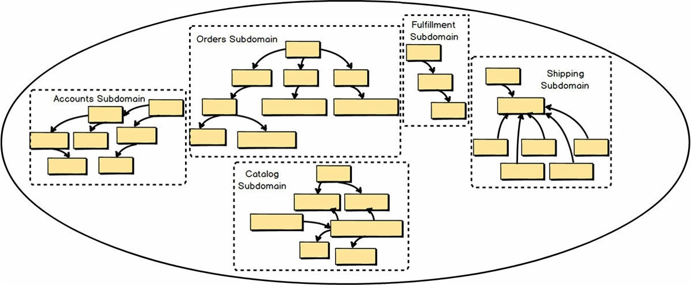

## 第三章、带有子域的战略设计 

当你在DDD项目上工作时，总是有多个Bounded Contexts在发挥作用。其中一个Bounded Contexts是核心域，其他Bounded Contexts中也会有各种子域。在上一章中，你看到了用特定的泛在语言划分不同模型并形成多个Bounded Contexts的重要性。

  

前面的图中有六个上下文和六个子域。由于采用了DDD战略设计，各团队实现了最优化的建模构成：每个约束上下文有一个子域，每个子域有一个约束上下文。换句话说，敏捷项目管理核心既是一个干净的Bounded Context，也是一个干净的Subdomain。在某些情况下，一个Bounded Context中可能有多个Subdomain，但这并不能达到最理想的建模结果。 

### 什么是子域？ 

简单地说，一个子域是你整个业务领域的一个子部分。你可以把子域看作是代表一个单一的、逻辑的域模型。大多数业务域通常太大、太复杂，无法作为一个整体进行推理，所以我们通常只关心我们在一个项目中必须使用的子域。子域可以被用来从逻辑上分解你的整个业务领域，这样你就可以理解你在一个大型复杂项目中的问题空间。 

另一种思考子域的方式是，它是一个明确的专业领域，假设它负责为你的业务的一个核心领域提供解决方案。这意味着特定的子域将有一个或多个领域专家，他们非常了解特定子域所促进的业务的各个方面。该子域对您的业务也有或多或少的战略意义。 

如果使用DDD来开发，子域会被实现为一个干净的有界限的上下文。专注于该业务领域的领域专家本应是开发 "约束性上下文 "的团队成员。尽管使用DDD来开发一个干净的Bounded Context是最佳选择，但有时我们只能希望是这样的。 

### 子域的类型 

一个项目中主要有三种类型的子域。 

- 核心领域。这是你对单一的、定义明确的领域模型进行战略投资的地方，投入大量资源，在明确的受限环境中精心设计你的泛在语言。这在你的组织的项目清单上是非常重要的，因为它将使你的组织区别于所有的竞争对手。由于你的组织不可能在它所做的每一件事上都能出类拔萃，你的核心领域划定了它必须擅长的地方。要达到做出这种判断所需的深度学习和理解水平，需要承诺、协作和实验。这是组织需要最自由地投资于软件的地方。我在本书后面提供了加速和有效管理此类项目的方法。 

- 支持子域。这是一个需要定制开发的模型情况，因为不存在现成的解决方案。然而，你仍然不会像你为核心域所做的那种投资。你可能要考虑将这种 "有界环境 "外包出去，以避免误认为它是一种具有战略意义的东西，从而对它进行大量的投资。这仍然是一个重要的软件模型，因为没有它，你的核心领域就不能成功。 

- 通用子域。这种解决方案可能可以现成购买，但也可能是外包的，甚至是由一个团队在内部开发的，该团队没有你分配给核心域或甚至较小的支持子域的那种精英开发人员。要注意不要把通用子域误认为是核心域。你不希望在这里做这样的投资。 

在讨论一个采用DDD的项目时，我们最可能讨论的是一个核心领域。 

### 处理复杂问题 

业务领域内的一些系统边界很可能是遗留系统，也许是你的组织创建的系统，或者是通过软件许可购买的系统。在这一点上，你可能对改善这些遗留系统没有什么办法，但当它们对你的核心领域项目有影响时，你仍然需要对它们进行推理。要做到这一点，请使用子域作为讨论你的`问题空间`的工具。

  

不幸的是，但同样是事实，一些遗留系统与DDD的有界上下文设计方式背道而驰，你甚至可以把它们称为无界的遗留系统。这是因为这样的遗留系统是我已经提到过的大泥球。在现实中一个系统充满了多种纠结的模式，这些模式本应是单独设计和实施的，但却被混杂在一起，成为一个非常复杂和交织的混乱局面。 

  

换句话说，当我们讨论一个遗留系统时，可能有一些，甚至很多逻辑域模型存在于这个遗留系统中。想想这些逻辑领域的每一个模型作为一个子域。在图中，每个逻辑子域在无边界的传统单体大泥球中都被一个虚线框标出。一共有五个逻辑模型或子域。把逻辑子域当作是帮助我们处理大型系统的复杂性的方法。这很有意义，因为它允许我们把问题空间当作使用DDD和多个Bounded Contexts来开发的。 

如果我们想象独立的`泛在语言`，遗留系统似乎不那么单一和泥泞，至少为了理解我们必须如何与之整合。使用子域来思考和讨论这种遗留系统，有助于我们应对大型纠缠模型的严酷现实。当我们使用这个工具进行推理时，我们可以确定哪些子域更适合于我们。

对业务有价值的和对我们的项目有必要的，以及那些可以降到较低地位的。考虑到这一点，你甚至可以在同一个简单的图表中显示你正在进行的或即将进行的核心域。这将有助于你理解子域之间的关联和依赖关系。但我将把这个讨论的细节留到上下文映射中。 

  

当使用DDD时，有界上下文应与单个子域一对一（1:1）对齐。也就是说，当使用DDD时，如果有一个Bounded Context，那么作为一个目标，有一个子域模型在那是一个有边界的环境。这不一定能实现，也不一定实用，但在可能的情况下，以这种方式设计是很重要的。这将使你的 "边界环境 "保持干净，并专注于核心战略举措。 

如果你必须在相同的 Bounded Context 中（在你的核心域中）创建第二个模型，你应该使用一个完全独立的模块 \[IDDD\] 将辅助模型与核心域隔离开来。 DDD 模块在 Scala 和 Java 中基本上是一个包，在 F# 和 C# 中是一个命名空间）。这在语言上清楚地表明，一个模型是核心，另一个只是辅助。这种隔离子域的特殊用法是你会在你的解决方案空间中采用的一种。 

### 摘要 

综上所述，你已经学会了。 

- 什么是子域以及如何使用子域，在问题空间和解决方案空间中都是如此 
- 核心域、支持性子域和通用子域之间的区别
- 在推理与大泥球遗留系统的整合时如何利用子域 
- 将DDD约束上下文与单一子域一一对应的重要性 
- 当使用DDD模块将支持性子域模型与核心域模型分隔在不同的约束上下文中是不现实的时候，你应该如何将两者分隔开来关于子域的详尽内容，请参见《实施领域驱动设计》\[IDDD\]第二章。