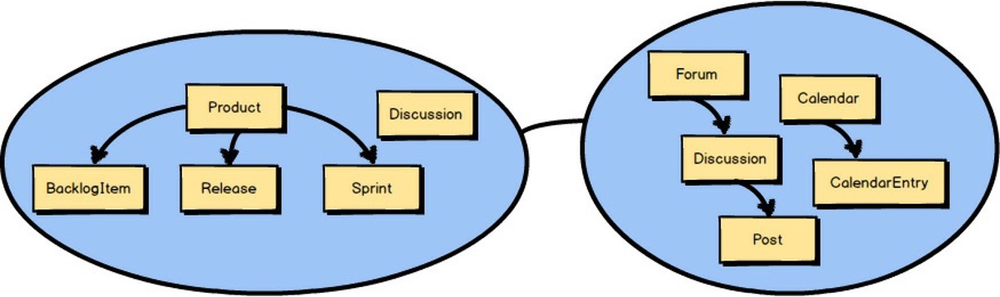
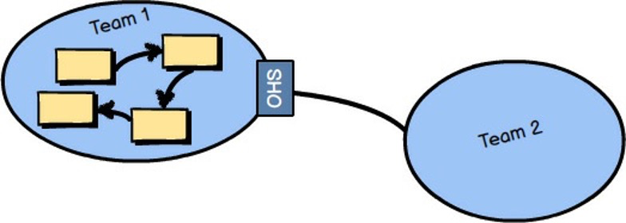
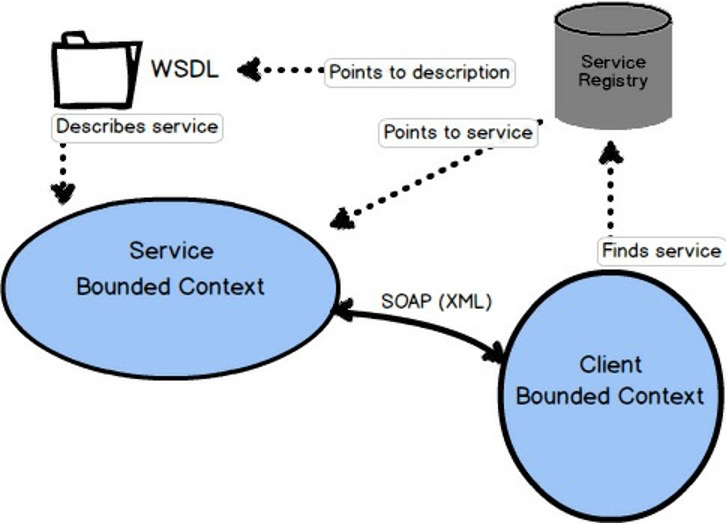

## 第四章、用语境映射进行战略设计 

  

在前几章中，你了解到除了核心领域外，每个DDD项目都有多个绑定的上下文。所有不属于敏捷项目管理上下文（核心领域）的概念，都被移到其他几个约束上下文中的一个。 

  

你还了解到，敏捷项目管理的核心领域必须与其他有边界的上下文整合。这种整合在DDD中被称为 "语境映射"。你可以看到在前面的语境图显示，"讨论"存在于两个有边界的语境中。回顾一下，这是因为"协作"背景是讨论的来源，而敏捷项目管理背景是讨论的`消费者`。

  

在这个图中，虚线框内的线条强调了一个上下文映射。虚线框不是上下文映射的一部分，只是用来突出这条线）。它实际上是这条线在两个有边界的上下文之间，代表一个上下文映射。换句话说，这条线表示这两个 "有界上下文 "以某种方式被映射了。在这两个 "边界上下文 "之间会有一些团队间的动态，也会有一些整合。 

  

考虑到在两个不同的受限环境中，有两种无所不在的语言，这条线代表了两种语言之间存在的翻译。举例来说，想象一下两个团队需要一起工作，但他们跨越国界工作，并且不说同一种语言。这两个团队要么需要一个翻译，要么一个或两个团队都必须大量学习对方的语言。找到一个翻译对两个团队来说都是较少的工作，但它可能在各方面都很昂贵。例如，想象一下，一个团队需要额外的时间与口译员交谈，然后由口译员向另一个团队转述这些陈述。这在最初的时候还行，但后来就变得很麻烦了。尽管如此，各小组可能会发现这比学习和接受一门外语并不断地在不同语言之间转换要好得多。当然，这只是描述两个团队之间的关系。如果还有其他几个团队参与进来呢？同样，当把一种泛在语言翻译成另一种语言，或以某种其他方式适应另一种泛在语言时，也会存在同样的权衡。 

  

当我们谈论Context Mapping时，我们感兴趣的是任何两个Bounded Context之间的线所代表的团队间的关系和整合是什么。定义良好的边界和它们之间的契约支持随着时间的推移而发生的可控变化。有几种背景映射，包括团队和技术，可以用线来表示。在某些情况下，团队间的关系和集成映射都会被混合。 

### 映射的种类

哪些关系和整合可以通过上下文映射线来表示？我现在就把它们介绍给你。 

#### 伙伴关系 
  

两个团队之间存在一种伙伴关系。每个团队负责一个有边界的环境。他们创建一个伙伴关系，使两个团队与一组依赖性的目标保持一致。据说，这两个团队将一起成功或失败。由于他们是如此紧密地结合在一起，他们将经常见面，以同步时间表和依赖性工作，他们必须使用持续集成来保持他们的集成的和谐。这种同步性由两个团队之间的粗的映射线表示。粗线表示所需的承诺水平，这是很高的。 

长期维持伙伴关系可能是一个挑战，所以许多进入伙伴关系的团队可能最好对关系的期限设置限制。合作关系应该只持续到它提供优势的时候，当优势被承诺的消耗压倒的时候，它应该被重新定位到一个不同的关系。 

#### 共享的内核 

  

共享内核（Shared Kernel），在第54页由两个受限上下文的交叉点描述，描述了两个（或更多）团队之间的关系，它们共享一个小的但共同的模型。这些团队必须同意他们要共享哪些模型元素。有可能只有其中一个团队会维护代码，构建和测试共享的内容。一个共享的内核往往一开始就很难构思，也很难维护，因为你必须在团队之间进行公开的沟通，并就什么是要共享的模型不断达成协议。尽管如此，如果所有参与的人都致力于内核比各自为政要好的想法，还是有可能成功的（见后面的章节）。

#### 客户-供应商 
  

客户-供应商描述了两个有界背景和各自团队之间的关系，其中供应商是上游（图中的U），客户是下游（图中的D）。供应商在这种关系中占据主导地位，因为它必须提供客户需要的东西。客户应与供应商一起计划，以满足各种期望，但最终由供应商决定客户将得到什么以及何时得到。只要企业文化不允许供应商完全自主，不对客户的真正需求做出反应，那么这种关系在团队之间是非常典型和实用的，甚至在同一组织内也是如此。 

#### 循规蹈矩的人 

  

当有上游和下游团队时，就会出现顺从关系，而上游团队没有动力去支持下游团队的特定需求。由于各种原因，下游团队无法持续努力翻译上游模型的泛在语言以适应其特定需求，所以该团队符合上游模型的原样。一个团队通常会成为一个顺应者，例如，当与一个非常大的、复杂的、成熟的模型整合时。例子。考虑到在整合成为亚马逊的一个联盟卖家时，需要符合亚马逊的模式。

#### 反腐化层 

  

防腐层是最具防御性的上下文映射关系，下游团队在其泛在语言（模型）和其上游的泛在语言（模型）之间建立一个翻译层。该层将下游模型与上游模型隔离开来，在两者之间进行翻译。因此，这也是一种整合的方法。 

只要有可能，你应该尝试在你的下游模型和上游整合模型之间建立一个反腐层，这样你就可以在你的整合一侧产生特别适合你的业务需求的模型概念，并使你与外国完全隔离。 

概念。然而，就像雇用翻译在两个讲不同语言的团队之间行事一样，在某些情况下，成本可能在不同方面太高。 

#### 开放式主机服务 

  

一个开放的主机服务定义了一个协议或接口，该协议或接口将你的Bounded Context作为一组服务进行访问。该协议是 "开放的"，因此，所有需要与你的 "边界上下文 "集成的人都可以相对容易地使用它。应用程序编程接口（API）所提供的服务有很好的文档记录，使用起来很方便。即使你是这个图中的第2小组，不能花时间为你这边的集成创建一个隔离的反腐层，作为这个模型的顺应者也比你可能遇到的许多遗留系统要容易容忍得多。我们可以说，开放主机服务的语言比其他类型的系统的语言更容易被消费。

#### 出版语言 

  

发布的语言，如第57页底部的图片所示，是一种有据可查的信息交换语言，能够被任何数量的消费型有界背景所简单消费和翻译。读和写的消费者都可以从共享语言中翻译出来，并相信他们的整合是正确的。这样的发布语言可以用XML Schema、JSON Schema或更理想的线格式（如Protobuf或Avro）来定义。通常情况下，一个开放主机服务会服务和消费一个发布的语言，这为第三方提供了最好的集成体验。这种组合使得两种泛在语言之间的翻译非常方便。 

#### 分开的方式 
  

Separate Ways描述了这样一种情况：通过消费各种泛在语言，与一个或多个受限语境的整合不会产生显著的回报。也许你所寻求的功能并不完全由任何一种泛在语言提供。在这种情况下，在你的边界语境中产生你自己的专门解决方案，并忘记为这种特殊情况进行整合。

大泥球 

在前面的章节中，你已经学到了很多关于大泥球的知识，但我要强调的是，当你必须在其中工作或与之整合时，你会遇到很多严重的问题。应该像避免瘟疫一样避免创建你自己的大泥球。 

  

如果这还不够警告，下面是当你负责创建一个大泥球时，随着时间的推移会发生什么。
  

(1) 越来越多的聚合体因为不正当的联系和依赖关系而交叉污染。
(2) 维护大泥球的一个部分会导致在整个模型中产生涟漪，这导致了 "打地鼠 "问题。
(3) 只有部落知识和英雄主义--同时说所有的语言--才能使系统免于完全崩溃。

问题是，在软件系统的广阔世界里，已经有许多大球的泥巴，而且这个数字无疑会每月增加。即使你能够避免通过采用DDD技术创建一个大泥球，你可能仍然需要与一个或多个系统集成。如果你必须与一个或多个系统集成，请尝试针对每个遗留系统创建一个反腐层，以保护你自己的模型不受杂物的影响，否则你的模型就会被难以理解的杂物所污染。无论你做什么，都不要说这种语言 
  

### 善用语境图 
  

你可能想知道会提供什么样的接口来让你与一个特定的Bounded Context集成。这取决于拥有Bounded Context的团队提供什么。它可能是通过SOAP的RPC，或带有资源的RESTful接口，也可能是一个使用队列或发布-订阅的消息传递接口。在最不利的情况下，你可能被迫使用数据库或文件系统集成，但我们希望这不会发生。数据库集成真的应该被避免，如果你被迫以这种方式进行集成，你真的应该确保通过防破坏层来隔离你的消费模型。 

让我们来看看三种更值得信赖的集成类型。我们将从最不健壮的集成方式转到最健壮的集成方式。首先我们将看看RPC，其次是RESTful HTTP，然后是消息传递。 

#### 使用SOAP的RPC 

  

远程过程调用，或称RPC，可以以多种方式工作。使用RPC的一种流行方式是通过简单对象访问协议，或SOAP。使用SOAP的RPC背后的想法是使使用另一个系统的服务看起来像一个简单的本地程序或方法调用。但是，SOAP请求必须通过网络，到达远程系统，成功执行，并通过网络返回结果。这就有可能出现完全的网络故障，或者至少是在第一次实现集成时没有预料到的延时。此外，SOAP上的RPC也意味着客户端边界上下文和提供服务的边界上下文之间的强耦合。 

使用SOAP或其他方法的RPC的主要问题是，它可能缺乏稳健性。如果网络出了问题，或者托管SOAP API的系统出了问题，你的貌似简单的过程调用会完全失败，只给出错误的结果。不要被表面上的易用性所迷惑。 

当RPC工作时--而且大多数情况下是工作的--它可以是一种非常有用的集成方式。如果你能影响服务Bounded Context的设计，那么如果有一个设计良好的API，提供一个具有发布语言的开放主机服务，这对你是最有利的。无论哪种方式，你的客户端Bounded Context都可以设计一个Anticorruption Layer，将你的模型与不需要的外部影响隔离开来。 

#### RESTful HTTP 

使用RESTful HTTP进行集成的重点是在Bounded Contexts之间交换的资源，以及四个主要操作。POST, GET, PUT, 和DELETE。许多人发现，REST方法的集成效果很好，因为它有助于他们为分布式计算定义良好的API。鉴于互联网和网络的成功，很难反驳这种说法。

当你使用RESTful HTTP时，有一种非常确定的思维方式。我不会在本书中讨论这些细节，但在尝试采用REST之前，你应该研究一下。REST in Practice\[RiP\]这本书是一个很好的开始。 

采用REST接口的服务Bounded Context应该提供一个开放的主机服务和一个发布的语言。资源应该被定义为一种发布的语言，并与你的REST URIs结合，它们将形成一个自然的开放主机服务。 

RESTful HTTP往往会因为许多与RPC相同的原因而失败--网络和服务提供商的故障，或意料之外的延迟。然而，RESTful HTTP是以互联网为前提的，当涉及到可靠性、可扩展性和整体的成功时，谁能对网络的记录找到错误呢？ 

在使用REST时，一个常见的错误是设计直接反映领域模型中的聚合体的资源。这样做迫使每一个客户进入一个顺应关系，如果模型改变形状，资源也会改变。所以你不希望这样做。相反，资源应该被综合设计，以遵循客户驱动的用例。我所说的 "合成 "是指对客户提供的资源必须具有他们所需要的形状和组成，而不是实际领域模型的样子。有时，模型看起来就像客户需要的那样。但客户的需求是驱动资源设计的因素，而不是模型的当前构成。 

#### 消息传递 

当使用异步消息传递进行集成时，许多事情可以通过客户端的Bounded Context订阅由你自己或另一个Bounded Context发布的领域事件来完成。使用消息传递是最强大的集成形式之一，因为你消除了与RPC和REST等阻塞形式相关的大部分时间耦合。由于你已经预见到了消息交换的延迟，你倾向于建立更稳健的系统，因为你从不期望立即得到结果。 

使用REST进行异步操作 

使用基于REST的轮询顺序增长的资源集来完成异步消息传递是可能的。使用后台处理，客户端将持续轮询服务的Atom feed资源，该资源提供了一个不断增加的领域事件集。这是一种安全的方法，可以维持服务和客户端之间的异步操作，同时提供持续发生在服务中的最新事件。如果服务由于某种原因变得不可用，客户端将简单地在正常的时间间隔内重试，或用重试的方式退缩，直到馈送资源再次可用。 

这种方法在《实施领域驱动设计》\[IDDD\]中得到了详细讨论。 

避免整合列车失事

当一个客户端边界上下文（C1）与一个服务边界上下文（S1）集成时，C1通常不应该向S1发出同步的、阻塞的请求，作为处理向它发出的请求的直接结果。也就是说，当其他客户端（C0）向C1发出阻塞请求时，不要让C1向S1发出阻塞请求。这样做很有可能造成C0、C1和S1之间的整合失误。这可以通过使用异步消息传递来避免。 

通常情况下，一个Bounded Context中的Aggregate会发布一个Domain Event，它可以被任何数量的相关方所消费。当一个订阅的Bounded Context收到领域事件时，将根据其类型和价值采取一些行动。通常情况下，它将导致一个新的聚合体被创建或现有的聚合体在消费的Bounded Context中被修改。 

域名事件的消费者是遵从者吗？ 

你可能想知道领域事件如何能被另一个边界上下文消费，并且不强迫消费的边界上下文进入顺应关系。正如 Implementing Domain-Driven Design \[IDDD\] 中所建议的，特别是在第 13 章 "整合边界上下文 "中，消费者不应该使用事件发布者的事件类型（例如类）。相反，它们应该只依赖于事件的模式，也就是它们的发布语言。这通常意味着，如果事件是以JSON或更经济的对象格式发布的，消费者应该通过解析事件来获取它们的数据属性。  

当然，上述内容假定订阅的边界上下文总是能够从发布的边界上下文中未经请求的事件中受益。然而，有时候，客户边界上下文需要主动向服务边界上下文发送一个命令消息，以强制执行一些行动。在这种情况下，客户Bounded Context仍然会收到作为发布的域事件的任何结果。

在所有使用消息传递进行集成的情况下，整个解决方案的质量将在很大程度上取决于所选消息传递机制的质量。消息传递机制应该支持至少一次传递（At-Least-Once Delivery）\[Reactive\]，以确保所有消息最终都能被收到。这也意味着订阅Bounded Context必须被实现为一个Idempotent Receiver \[Reactive\] 。 

At-Least-Once Delivery\[反应式\]是一种信息传递模式，信息传递机制将定期重新传递给定的信息。这将在消息丢失、反应迟缓或出现以下情况时进行 

瘫痪的接收者，以及接收者未能确认收到。由于这种消息传递机制的设计，即使发送者只发送一次，消息也有可能被传递不止一次。尽管如此，当接收者被设计为处理这个问题时，这也不需要成为一个问题。 

每当一个消息可能被传递一次以上，接收器就应该被设计成能正确处理这种情况。Idempotent Receiver \[Reactive\]描述了请求的接收者如何以这样一种方式执行操作，即即使执行多次也会产生相同的结果。 

因此，如果同一消息被多次收到，接收方将以安全的方式处理它。这可能意味着接收方使用去重，忽略重复的信息，或者安全地重新应用操作，其结果与前次传递造成的完全相同。 

由于消息传递机制总是引入异步的请求-响应\[Reactive\]通信，一定程度的延迟是常见的，也是预期的。对服务的请求应该（几乎）不会阻塞，直到服务得到满足。因此，在设计时考虑到消息传递，意味着你将始终为至少一些延迟做好计划，这将使你的整体解决方案从一开始就更加稳健。

语境映射中的一个例子 

回到第二章中讨论的一个例子，"有边界的背景和泛在语言的战略设计"，一个关于官方政策类型的位置的问题出现了。请记住，在三个不同的有界背景下有三种不同的政策类型。那么，"记录的保单 "在保险企业中处于什么位置？有可能它属于核保部门，因为那是它的发源地。在这个例子中，我们假设它确实属于核保部门。那么，其他的 "有界背景 "是如何知道它的存在的呢？ 

当一个保单类型的组件在承保上下文中被发布时，它可以发布一个名为PolicyIssued的领域事件。通过消息订阅提供，任何其他边界上下文可以对该领域事件做出反应，这可能包括创建一个相应的签署约束的背景下的政策部分。

PolicyIssued Domain事件将包含官方政策的身份。这里是 policyId 。任何在订阅的边界上下文中创建的组件都将保留该身份，以便追溯到最初的承保上下文。在这个例子中，该身份被保存为 issuedPolicyId 。如果需要比 PolicyIssued Domain 更多的政策数据 

提供的事件，订阅的 Bounded Context 可以随时向 Underwriting Context 查询更多信息。这里，订阅的 Bounded Context 使用 issuedPolicyId 对 Underwriting Context 进行查询。 

丰富的内容与查询的权衡 

有时候，用足够的数据来充实领域事件，以满足所有消费者的需求，是有好处的。有时，保持领域事件的稀薄，并允许在消费者需要更多的数据时进行查询，也是一种优势。第一种选择，充实，允许依赖性消费者有更大的自主权。如果自主性是你的驱动需求，请考虑充实。 

另一方面，很难预测所有消费者在域事件中需要的每一项数据，如果你提供所有的数据，可能会有太多的丰富。例如，极大地丰富域事件可能是一个糟糕的安全选择。如果是这样的话，设计薄的领域事件和一个丰富的查询模型，让消费者从中请求，可能是你需要的选择。 

有时，情况会要求平衡地融合这两种方法。

那么，对承保上下文的查询可能如何进行？你可以设计一个RESTful开放主机服务并在承保上下文上发布语言。一个简单的HTTP GET和issuedPolicyId将检索到IssuedPolicyData。 

你可能想知道政策发布域事件的数据细节。我将在第6章中提供领域事件的设计细节，"用领域事件进行战术设计"。

你是否对敏捷项目管理背景下的例子感到好奇？从这个例子中游离到保险业务领域，使你能够用多个例子来研究DDD。这应该有助于你更好地掌握DDD。别担心，我们将在下一章中重新讨论敏捷项目管理背景。 

### 摘要 

综上所述，你已经学会了。 

- 关于各种类型的背景映射关系，如伙伴关系、客户供应商和反腐败层 
- 如何使用上下文映射与RPC、与RESTful HTTP以及与消息传递的整合 - 领域事件如何与消息传递协同工作 
- 你可以在此基础上建立你的语境图谱经验 

关于上下文图的详细介绍，请参见《实施领域驱动设计》\[IDD\]的第三章。