## 第7章、加速和管理工具 

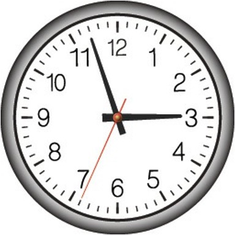  

在使用DDD时，我们正在寻求对业务运作方式的深入学习，然后根据我们的学习程度来建立软件模型。这实际上是一个学习、实验、挑战、再学习、再建模的过程。我们需要大量地压缩和提炼知识，并产生一个能有效满足组织战略需求的设计。挑战在于，我们必须**快速**学习。在一个快节奏的行业中，我们通常是在与时间赛跑，因为时间很重要，而且时间通常会推动我们的许多决定，甚至可能比它应该的更多。如果我们不能在预算内按时交付，无论我们的软件取得了什么成果，我们似乎都失败了。而每个人都在指望我们在各方面取得成功。 

有些人已经努力说服管理层，大多数项目时间估计是没有价值的，不能成功使用。我不确定这些努力在大型项目中的效果如何，但与我合作的每一个客户仍然受到压力，必须在非常具体的时间框架内交付，这就迫使在设计/实施过程中采用时间框。在最好的情况下，这是一场软件开发和管理之间的持续斗争。 

不幸的是，对于这种负面的压力，一个常见的反应是试图通过取消设计来节省开支和缩短时间。回顾第一章，设计是不可避免的，要么你会因为糟糕的设计而做得很差，要么你会因为有效的设计而交付成功，甚至可能是好的设计。所以，你应该尝试做的是正视时间的要求，以加速的方式进行设计，使用能够帮助你在你所面临的时间限制内提供最好的设计的方法。 

为此，我在本章中提供了一些非常有用的设计加速和项目管理工具。首先，我讨论了 "事件风暴"（Event Storming），然后以一种利用该协作过程产生的工件来创建有意义的、最好是可实现的估算的方法来结束。

### 事件风暴 

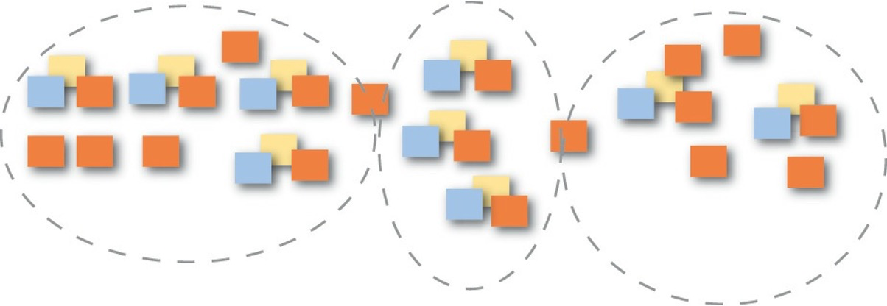  

事件风暴是一种快速设计技术，旨在让领域专家和开发人员参与到一个快节奏的学习过程中。它的重点是业务和业务流程，而不是名词和数据。 

在学习Event Storming之前，我使用了一种技术，我称之为事件驱动建模。它通常涉及对话、具体场景和使用非常轻量级UML的以事件为中心的建模。UML的具体步骤可以单独在白板上实现，也可以用工具来捕捉。然而，正如你可能知道的，很少有业务人员了解并精通UML的使用，即使是最简单的使用。所以，这就把练习的大部分建模部分留给了我或其他了解UML基础知识的开发者。这是一个非常有用的方法，但必须有一个方法让业务专家更直接地参与这个过程。这可能意味着不使用UML，而使用一个更有吸引力的工具。 

几年前，我第一次从Alberto Brandolini [Ziobrando](https://leanpub.com/introducing_eventstorming) 那里了解到Event Storming，他也曾尝试过另一种形式的事件驱动建模。有一次，由于时间不够，Alberto决定放弃UML，改用便签。这就是一种快速学习和软件设计方法的诞生，它让房间里的每个人都直接参与到这个过程中。以下是它的一些优点。 

- 这是一个非常有触觉的方法。每个人都有一张便签纸和一支笔，并负责为学习和设计会议作出贡献。业务人员和开发人员在一起学习时都站在平等的位置上。每个人都为`泛在语言`提供输入。 
- 它把每个人都集中在事件和业务流程上，而不是在类和数据库上。
- 这是一种非常直观的方法，它将代码从实验中剔除，并将每个人放在设计过程中的平等地位。 
- 它的执行速度非常快，而且非常便宜。你可以在几个小时内，而不是几周内，以粗略的格式“风暴”出一个新的`核心域`。如果你在便条上写了一些东西，而你后来发现这些东西不起作用，你就把便条包起来，扔掉它。你只需为这个错误花费一两分钱，而且由于已经投入了努力，没有人会拒绝改进的机会。 

- 你的团队将在理解上有所突破。我敢肯定。这种情况每次都会发生。有些人在参加会议时，会认为他们对具体的核心商业模式已经有了相当好的理解。但不管怎样，他们总是带着对业务流程的更多理解甚至是新的见解离开。 

- 每个人都能学到一些东西。无论你是一个`领域专家`还是一个软件开发人员，你都会在会议结束后对手头的模型有一个清晰的理解。这与实现突破是不同的，其本身也是很重要的。在许多项目中，至少有一些项目成员，甚至可能有许多成员，不理解他们正在做的事情，直到为时已晚，而且损害已经在代码中了。风暴式的模型可以帮助大家消除误解，在统一的方向和目标下前进。 

- 这意味着你也要尽可能早地、迅速地发现模型和理解方面的问题。消除误解，将结果作为新的洞察力加以利用。房间里的每个人都会受益。 

- 你可以将`事件风暴`用于`全局`和`设计层面`的建模。做全局的风暴会不那么精确，而设计层面的风暴会引导你走向某些软件工件。 

- 没有必要将风暴会议限制在一次。你可以先进行两小时的风暴会议，然后休息一下。在你的成就上睡一觉，第二天再回来，再花一两个小时来扩展和细化。如果你每天这样做两小时，持续三四天，你会对你的核心领域以及与周围子领域的整合有深刻的理解。 

下面是一份你在建立模型时需要的人员、思维方式和用品的清单。
- 拥有合适的人是至关重要的，这意味着领域专家和从事模型工作的开发人员。每个人都会有一些问题和一些答案。为了相互支持，在建模过程中，他们都需要在同一个房间里。 

- 每个人都应该带着开放的心态来，没有严格的判断。我在 "事件风暴 "会议上看到的最大错误是人们试图过早地得到“正确”结果。你反而应该完全下定决心，创造出远远多过的事件。更多的事件比更少的事件好，因为那会让你学到最多的东西。以后还有时间来完善，而完善是快速而廉价的。 

- 手头要有各种颜色的便条，而且要多多准备。你至少需要这些颜色：橙色、紫色/红色、浅蓝色、淡黄色、丁香色和粉红色。你可能会发现，其他颜色（如绿色；见后面的例子）也很方便。便条的尺寸可以是正方形（3英寸 x 3英寸，或7.62厘米 x 7.62厘米），而不是更广泛的矩形品种。你不需要在便条上写很多东西；通常只需要写几个字就可以了。考虑购买超粘性的品种。你不希望你的便条掉在地上。 

- 为每个人提供一支黑色记号笔，这将使笔迹显示得大胆而清晰。最好是细尖的记号笔。 

- 找到一个宽阔的墙，你可以在那里做模型。宽度比高度更重要，但你的建模面应该是大约一米/码高。宽度实际上应该是无限的，但10米/码的范围内的东西应该被认为是最小的。如果没有这样的墙，你可以使用一张长的会议桌或地板。桌子的问题是，它最终会限制你的建模空间。地板的问题是，团队中的每个人可能都无法接触到它。一面墙是最好的。

- 获得一卷长纸，例如在艺术商店、教学用品商店，甚至在宜家商店都可以找到。这张纸应该符合前面描述的尺寸，宽度至少为10米/码，高度为1米/码。用结实的胶带将纸挂在墙上。有些人可能决定放弃纸张，只在白板上工作。这可能适用于一时，但粘性纸条在白板上往往会随着时间的推移而失去粘性，尤其是当它们被拉起并重新贴在不同的位置时。粘性纸贴在纸上时粘性更长。如果你打算在三四天内进行短暂的建模，而不是在一次长的会议上，那么粘性的持久性就很重要。 

既然有了基本的用品，并且有合适的人参加会议，你就可以开始了。逐一考虑每一个步骤。 

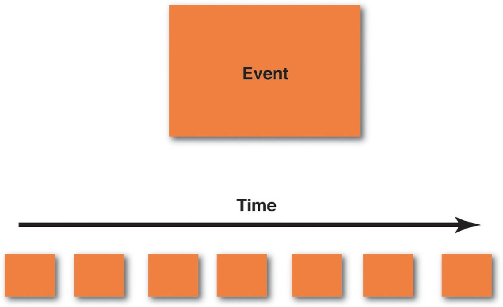  

1. 通过在便签纸上创建一系列的领域事件，将业务流程暴漏出来。最受欢迎的领域事件颜色是橙色。使用橙色可以使领域事件在建模表面最显眼的位置。 

以下是你在创建域名活动时应采用的一些基本准则。 

- 首先创建领域事件应该强调，我们的首要重点是业务流程，而不是数据及其结构。你的团队可能需要花10到15分钟来适应这个，但请按照我在这里概述的步骤来做。不要被诱惑去跳到前面。 

- 在一张便条上写下每个领域事件的名称。正如你在前一章学到的，这个名字应该是用过去式表示的动词。例如，一个事件可能被命名为ProductCreated ，另一个可能被命名为BacklogItemCommitted 。

你当然可以把这些名字分成多行写在便签上）。如果你在做大概念风暴，而你认为这些名字对参与者来说太精确了，那就用其他的名字。 

- 按照时间顺序将便签放在你的建模面上，也就是说，按照领域中每个事件发生的顺序从左到右。你从建模表面最左边的第一个领域事件开始，然后逐渐向右移动。有时你对时间顺序没有很好的理解，在这种情况下，你应该只把相应的域事件放在模型的某个地方。弄清楚 "何时 "的部分，这可能会变得很明显，稍后。 

- 根据你的业务流程，一个与另一个平行发生的领域事件可以位于同时发生的领域事件之下。所以，你用垂直空间来表示平行处理。 

- 当你通过这部分的风暴会议时，你将会在你现有的或新的业务流程中找到问题点。用紫色/红色的便条和一些解释为什么是问题的文字清楚地标记这些。你需要在这些点上投入时间来了解更多。 

- 有时一个领域事件的结果是一个需要运行的过程。这可能是一个单一的步骤或多个复杂的步骤。每个导致进程被执行的领域事件都应该被捕获，并在淡紫色便条上命名。用箭头画一条线，从领域事件到命名的过程（丁香色便条）。只有当细粒度的域事件对你的核心域很重要时，才对它进行建模。最有可能的是，用户注册过程是必要的，但可能不被认为是你的应用程序的核心特征。将注册过程建模为一个单一的粗粒度事件，UserRegistered ，然后继续前进。把你的精力集中在更重要的事件上。 

如果你认为你已经用尽了所有可能的重要领域事件 ，那么可能是时候休息一下，以后再来参加建模会议。一天后再回到建模表面，无疑会使你发现遗漏的概念，并完善或扔掉那些你以前认为重要的表面概念。即便如此，在某一时刻，你将已经确定了大部分最重要的领域事件。那时，你应该进入下一个步骤。

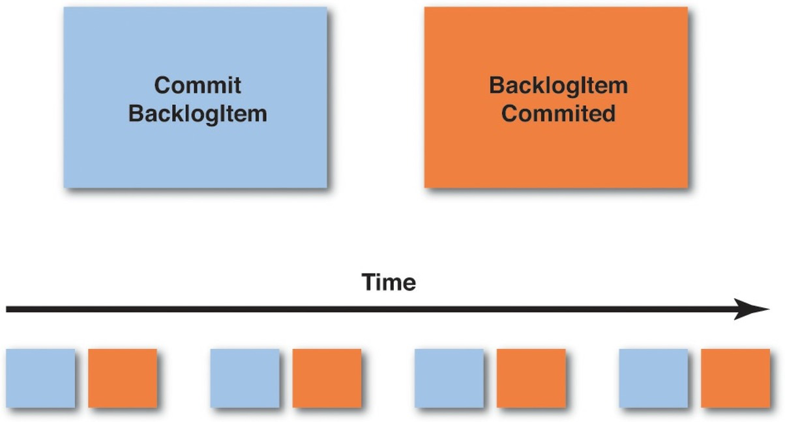  

2. 创建导致每个领域事件的命令。有时一个领域事件是另一个系统发生的结果，它将作为结果流入你的系统。然而，经常有一个命令是一些用户姿态的结果，而这个命令，当执行时，将引起一个领域事件。该命令应该以命令的形式出现，比如说 `CreateProduct` 和 `CommitBacklogItem` 。这些是一些基本准则。
- 在浅蓝色的便条上，写上引起每个相应领域事件的命令的名称。例如，如果你有一个域名事件名为 `BacklogItemCommitted`，导致该事件的相应命令被命名为`CommitBacklogItem`。 

- 将命令的浅蓝色粘性纸条放在它所引起的领域事件的左边。它们是成对关联的。`命令`/`事件` , `命令`/`事件` , `命令`/`事件` , 以此类推。记住，有些领域事件的发生是因为达到了时间限制，所以可能没有相应的命令来明确地引起它们。 

- 如果有一个特定的用户角色来执行某项操作，而且必须指明，你可以在浅蓝色的 "命令 "的左下角放一个小的、亮黄色的便条，上面有一个棍子和角色的名字。在上图中，"产品责任人" 将是执行该命令的角色。 

- 有时一个命令会导致一个`进程`的运行。这可能是一个单一的步骤或多个复杂的步骤。每个导致进程被执行的命令都应该被捕获，并在淡紫色便条上命名。用箭头画一条线，从命令到命名的进程（紫丁香便条）。进程实际上会引起一个或多个命令和随后的领域事件，如果你现在知道这些是什么，为它们创建便条，并显示它们从进程中发出。 

- 继续按照时间顺序从左到右移动，就像你第一次创建每个领域事件时那样。

- 创建命令可能会使你想到你以前没有想到的领域事件（如上面发现浅紫色`进程`，或其他的）。将新发现的域事件和它相应的命令放在建模面上。 

- 你也可能发现，只有一个命令会引起多个领域事件。这很好；为这一个命令建立模型，并把它放在它所引起的多个领域事件的左边。 

一旦你把所有的命令与它们引起的领域事件联系起来，你就可以进入下一步了。 

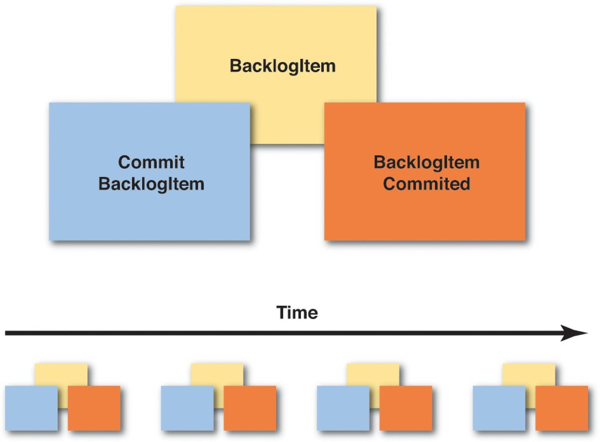  

3. 关联执行命令并产生领域事件结果的实体/集合。这就是执行命令和发出领域事件的数据持有者。实体关系图通常是当今IT世界中最受欢迎的第一步，但从这里开始是一个很大的错误。业务人员并不了解它们，而且它们会迅速终止交流。事实上，这一步在Event Storming中的位置已经被降到了第三位，因为我们更关注的是业务流程而不是数据。即便如此，我们确实需要在某个时间点上考虑数据，而这个时间点就是现在。在这个阶段，业务专家很可能会明白，数据是有作用的。

这里有一些关于建模Aggregates的准则。

- 如果商业人士不喜欢`Aggregate`这个词，或者它在任何方面让他们感到困惑，你应该使用另一个名字。通常他们可以理解`实体`，或者你可以直接叫它`数据`。重要的是，贴纸可以让团队清楚地交流它所代表的概念。对所有的聚合体使用淡黄色的便签，在每张便签上写上一个聚合体的名字。这是一个名词，比如`产品`或`BacklogItem`。你将为你的模型中的每个Aggregate做这件事。 

- 将 "聚合 "便条放在 "命令 "和 "领域 "事件对的后面和上面一点。换句话说，你应该能够读到写在聚合便条上的名词，但是命令和域事件对应该粘在聚合便条的下部，以表明它们是相关的。如果你真的想在贴纸之间留一点空间，那也可以，但要清楚哪些命令和领域事件属于哪个聚合体。 

- 当你在你的业务流程时间线上移动时，你可能会发现聚合体被反复使用。不要为了把所有的命令/事件对移到一张聚合便签下而重新安排你的时间线。相反，在多个便条上创建相同的聚合名词，并将它们重复放置在相应的命令/事件对出现的时间线上。主要的一点是对业务流程进行建模；业务流程是随着时间的推移而发生的。 

- 当你思考与各种行动相关的数据时，你有可能发现新的领域事件。不要忽视这些。相反，将新发现的领域事件与相应的命令和聚合体一起放在建模界面上。你也可能发现一些集合体太复杂了，你需要把这些集合体分解成一个管理的过程（浅丁香色粘纸）。不要忽视这些机会。 

一旦你完成了设计阶段的这一部分，你就接近了一些额外的步骤，如果你选择的话，你可以执行这些步骤。同时也要明白，如果你正在使用`事件溯源`，如前一章所述，你已经在理解你的核心域实现方面取得了很大的进展，因为`事件风暴`和`事件溯源`有很大的重合。当然，你的风暴越接近大局，它就有可能离实际执行越远。但是，你仍然可以使用这个相同的技术来达到设计层面的观点。根据我的经验，团队往往会在同一次会议中出入于大局和设计层面。最后，你对某些细节的需求会促使你超越大局，达到设计层面的模型，而这是至关重要的。

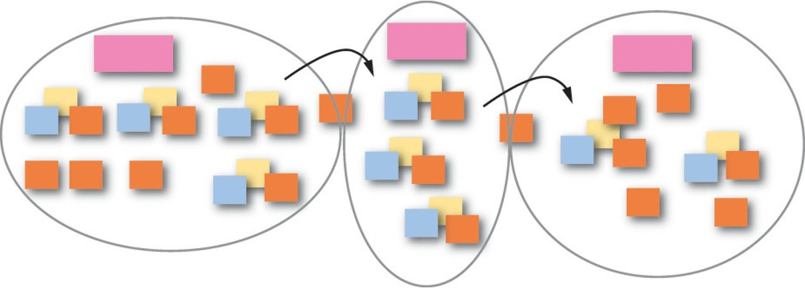  

4. 用箭头画出边界和线条，在你的建模表面显示流动。你很可能已经发现，有多个模型在起作用，而且Domain Events也在流动。 

在你的 "事件风暴 "会议中，在模型之间。下面是如何处理这个问题的。
- 总之，你很有可能在以下情况下发现边界：部门划分，当不同的业务人员对同一个术语有冲突的定义时，或者当一个概念很重要但并不真正属于`核心域`时。
- 你可以用你的黑色记号笔在纸上建模的表面上画画。显示上下文和其他的边界。用实线表示`有边界的上下文`，用虚线表示`子域`。显然，在纸上画边界是永久性的，所以在涉足之前要确保你了解这个层次的细节。如果你想在开始时用较少的永久性来限定模型，可以用粉红色的贴纸来标记一般的区域，在你有信心之前不要用永久性记号笔画边界。 

- 将粉红色的便签放在不同的边界内，并在这些便签上写上边界内适用的名称。这就为你的 "边界上下文 "命名。 

- 用箭头画线来显示领域事件在`边界上下文`之间流动的方向。这是一个简单的方法来传达一些领域事件如何到达你的系统，而不是由你的边界上下文中的命令引起的。 

关于这些步骤的任何其他细节都应该是直观的。只要用边界和线条来沟通。

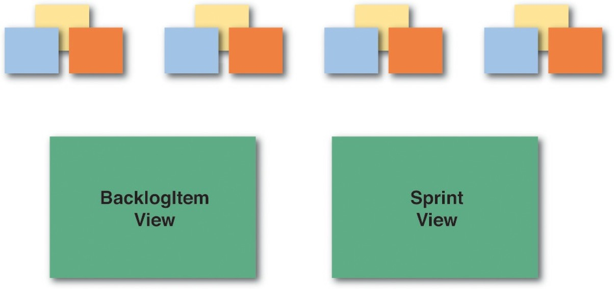  

5. 确定你的用户需要进行操作的各种视图，以及各种用户的重要角色。 

- 你不一定需要展示你的用户界面将提供的每一个视图，或者根本不需要。如果你决定展示任何视图，它们应该是那些重要的、需要特别注意创建的视图。这些视图工件可以用建模表面的绿色便签来表示。如果有帮助的话，为最重要的用户界面视图画一个快速模拟图（或线框图）。 

- 你也可以用亮黄色的便签来代表各种重要的用户角色。同样，只有当你需要传达一些关于用户与系统交互的重要信息，或者系统为特定角色的用户所做的事情时，才显示这些。 

第四和第五步很可能是你需要纳入事件风暴练习的所有额外内容。 

### 其他工具 

当然，这并不妨碍你进行实验，比如在你的建模表面上放置其他的图画，以及在事件风暴会议中尝试其他的建模步骤。记住，这是关于学习和交流一个设计。使用你需要的任何工具，作为一个紧密的团队进行建模。只是要注意拒绝仪式，因为那将会付出很大的代价。这里有一些其他的想法。 

引入高水平的可执行规范，遵循给定/何时/何时的方法。这些也被称为验收测试。你可以在Gojko Adzic的《Specification by Example》一书中读到更多关于这方面的内容 \[Specification\] ，我在第二章 "Strategic Design with Bounded Contexts and the Ubiquitous Language "中提供了一个例子。只是要注意不要过度使用这些东西，因为它们会变得无所顾忌，并优先于实际的领域模型。我估计，使用和维护可执行的规范而不是普通的基于单元测试的方法（也在第2章中演示），需要多花15%到25%的时间和精力，而且随着模型的变化，很容易陷入保持规范与当前业务方向相关的困境。

试试`影响映射`\[Impact Mapping\]，以确保你所设计的软件是一个核心领域，而不是一些不太重要的模型。这也是Gojko Adzic定义的一种技术。

看看Jeff Patton的User Story Mapping \[User Story Mapping\] 。这是用来将你的注意力放在核心领域上，并了解你应该投资于哪些软件功能。

前面三个附加工具与DDD理念有很大的重叠，相当适合引入到任何DDD项目中。它们都是为了在高度加速的项目中使用，仪式感不强，而且使用起来非常便宜。 

### 在敏捷项目中管理DDD 
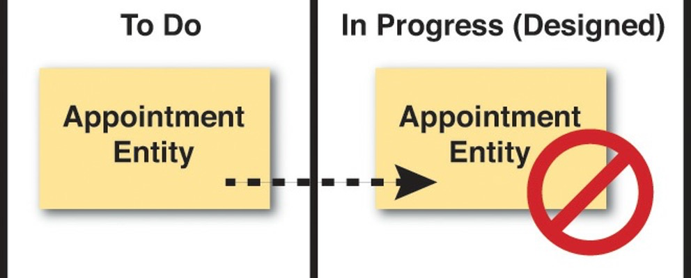  

我以前提到过，围绕着所谓的 "无估计 "已经有了一场运动。这是一种拒绝典型估算方法的方法，例如故事点或任务时间。它专注于交付价值而不是控制成本，并且不估算任何可能只需要几个月就能完成的任务。我并不否定这种方法。然而，在写这篇文章的时候，与我合作的客户仍然被要求提供估算，并对任务进行时间框定，例如实现细微功能所需的编程工作。如果 "不估算 "适合你和你的项目情况，就使用它。 

我也意识到，DDD社区中的一些人基本上已经定义了他们自己的流程或流程执行框架，以便在项目中使用DDD并执行它。当它被一个特定的团队接受时，这可能会很有效，但要从已经投资于敏捷执行框架（如Scrum）的组织中获得认同，可能会比较困难。 

我观察到，最近Scrum受到了相当多的批评。虽然我并不偏袒这种批评，但我要公开声明，很多时候甚至大多数时候Scrum都被滥用了。我已经提到了团队使用我称之为 "任务板洗牌 "的方式进行 "设计 "的趋势。这不是Scrum在软件项目中使用的方式。而且，我再重复一遍，知识获取既是Scrum的宗旨，也是DDD的主要目标，但在很大程度上被忽略了，以换取Scrum的无情交付。即便如此，Scrum仍然在我们的行业中被大量使用，而且我怀疑它很快就会被取代。 

因此，我在这里要做的是告诉你如何让DDD在基于Scrum的项目中发挥作用。我向你展示的技术应该同样适用于其他敏捷项目方法，例如使用看板时。这里没有任何东西是Scrum所独有的，尽管有些指导是以Scrum的方式陈述的。由于你们中的许多人已经通过某种形式的实践熟悉了Scrum，所以我在这里的大部分指导将是关于领域模型的以及用DDD进行学习、实验和设计。你需要在其他地方寻找关于使用Scrum、Kanban或其他敏捷方法的一般指导。 

在我使用任务或任务板的地方，这应该与一般的敏捷，甚至是看板兼容。在我使用 "冲刺 "一词的地方，我也会尝试用 "迭代 "来表示一般的敏捷，用 "工作进展 "来表示看板。这可能并不总是完美的，因为我并不试图在这里定义一个实际的过程。我希望你能简单地从这些想法中受益，并找到一种方法将它们适当地应用于你的特定敏捷执行框架。 

### 第一件事 

在项目中成功采用DDD的最重要手段之一是雇用优秀人才。优秀的人，以及高于平均水平的开发人员，是无法替代的。DDD是一种先进的软件开发理念和技术，它要求高于平均水平的开发人员，甚至是非常优秀的开发人员，才能将其投入使用。永远不要低估雇用具有正确技能和自我激励的合适人员的重要性。 

### 使用SWOT分析 
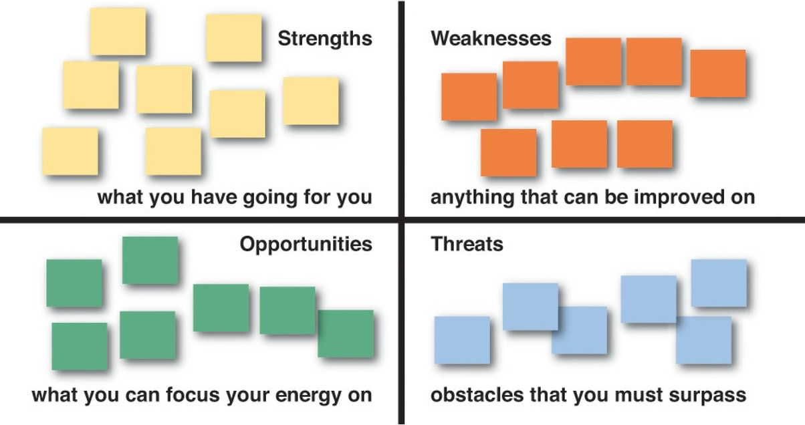  

如果你对SWOT分析\[SWOT\]不熟悉，它代表着优势、劣势、机会和威胁。SWOT分析是一种方法，让你以非常具体的方式思考你的项目，尽早获得最大的知识。以下是你要在项目上确定的基本想法。 

- 优势：企业或项目的特点，使其比别人有优势 
- 劣势：使企业或项目相对于别人处于劣势的特点 
- 机会：项目可以利用其优势的因素 
- 威胁：环境中可能给企业或项目带来麻烦的因素

在任何Scrum或其他敏捷项目的任何时候，你都应该感到自由和倾向于使用SWOT分析来确定你的项目的现状。 

1. 画一个有四个象限的大矩阵。 
2. 回到便签上，为四个SWOT象限各选择一种不同的颜色。
3. 现在，找出你项目的优势，你项目的劣势，你项目的机会，以及你项目的威胁。 
4. 把这些写在便条上，并把它们放在矩阵中适当的象限内。
5. 利用项目的这些SWOT特征（我们在这里特别考虑领域模型）来计划你要对它们做什么。你为促进好的方面和减轻麻烦的方面所采取的下一步措施可能对你的成功至关重要。 

在执行项目规划时，你将有机会把这些行动放在任务板上，这一点将在后面讨论。 

### 峰值建模和债务建模 

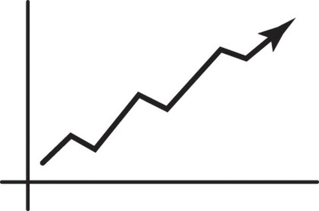  

当你得知在DDD项目上可能会有建模高峰和建模债务需要支付时，你是否感到惊讶？ 

在项目开始时，你能做的最好的事情之一是使用`事件风暴`(Event Storming) 。这和相关的建模实验将构成一个建模尖峰。你将不得不 "购买 "关于你的Scrum产品的知识，有时付款就是一个尖峰，而在项目初期出现尖峰几乎是肯定的。尽管如此，我已经向你展示了使用Event Storming可以大大减少必要的投资成本。 

可以肯定的是，你不能指望从一开始就对你的领域进行完美的建模，即使你在项目的开始阶段就认为有价值的建模秒杀。你甚至不会在使用Event Storming时做到完美。首先，业务和我们对它的理解会随着时间的推移而改变，你的领域模型也会如此。 

此外，如果你打算将你的建模工作作为任务板上的任务进行时间划分，那么在每个冲刺阶段（或迭代，或WIP）都会产生一些建模债务。当你有时间限制的时候，你根本没有时间去完成每一个理想的建模任务。首先，你会开始设计，并在实验后意识到你的设计并不像你预期的那样适合业务需求。然而，你所处的时间限制会要求你继续前进。

你现在可以做的最糟糕的事情就是忘记你从建模工作中所学到的所有东西，这些东西要求进行不同的、改进的设计。相反，要记下这需要在以后的冲刺阶段（或迭代，WIP）进行。这可以被带到你的回顾会议上，并作为一个在你的下一次冲刺计划会议（或迭代计划会议，或添加到看板队列）上的新任务。 

1. 在看板中，你实际上可以每天都有回顾会议，所以不要等很久才提出改进模型的需要。 

#### 确定任务和估计工作量 
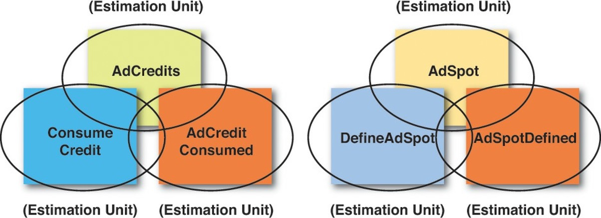  

`事件风暴`是一个可以在任何时候使用的工具，而不仅仅是在项目开始的时候。当你在事件风暴会议中工作时，你会自然地创建一些工件。你在纸质模型中冲出的每一个领域事件、命令和聚合体都可以作为估算单位。怎么说呢？ 

最简单和最准确的估计方法之一是使用基于度量的方法。正如你在这里所看到的，为你需要实施的每一个组件类型创建一个简单的表格，其中包含估算单位。这将消除估算中的猜测，并为创建工作估算的过程提供科学依据。下面是这个表格的工作原理。 
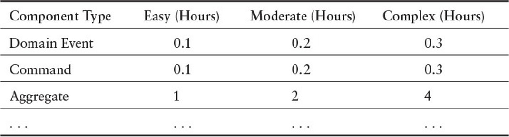  

1. 为组件类型创建一列，以描述定义估算单位的特定类型的组件。 
2. 创建另外三栏，分别为简单、中等和复杂。这些列将反映出特定单位类型的估算单位，即以小时或小时的零头为单位。
3. 现在为你的架构中的每个组件类型创建一行。显示的是领域事件、命令和聚合类型。然而，不要局限于这些。为以下类型创建一行。各种用户界面组件、服务、持久性、域事件序列化器和反序列化器，等等。请随意为你将在源代码中创建的每一种工件创建一个行。(例如，如果你通常和每个领域事件一起创建一个领域事件序列化器和反序列化器，作为一个综合步骤，给领域事件分配一个估计值，反映在每一列中所有这些组件的创建。) 
4. 现在填写每个复杂程度所需的小时或零点几小时：简单、中等和复杂。这些估计不仅包括实施所需的时间，而且还可能包括进一步的设计和测试工作。要使这些准确无误，而且要切合实际。 
5. 当你知道你要做的积压项目任务（WIP）时，为每项任务获得一个指标，并清楚地确定它。你可以使用电子表格来做这件事。 
6. 将当前冲刺（迭代或WIP）中所有组件的估算单位加起来，这就是你的总估算。 

当你执行每个冲刺（迭代或WIP）时，调整你的指标以反映实际需要的小时或分数。 

如果你正在使用Scrum，而且你已经开始厌恶小时估算，那么要明白这种方法要宽容得多，而且也要准确得多。当你学会了你的节奏后，你将对你的估算指标进行微调，使之更加准确和现实。这可能需要几个冲刺阶段才能做到这一点。还要认识到，随着时间和经验的增长，你可能会把你的数字调得更低，或者更容易使用 "简单 "或 "适度 "栏目。 

如果你正在使用看板，而你认为估算是完全谬误和不必要的，请问自己一个问题。为了正确限制我们的工作队列，我怎么知道如何首先确定一个准确的在制品？不管你怎么想，你仍然在估计所涉及的工作，并希望它是正确的。为什么不在这个过程中加入一点科学，使用这种简单而准确的估计方法呢？ 

#### 关于准确性的评论 

这种方法是有效的。在一个大型企业项目中，该组织要求对整个项目中的一个大型复杂项目进行估算。两个团队被分配到这项任务中。首先是一个由高成本顾问组成的团队，他们与财富500强公司合作，对项目进行评估和管理。他们是会计师，有博士学位，配备了一切可以让他们感到害怕和具有明显优势的东西。由建筑师和开发人员组成的第二个团队被赋予了这种基于度量的估算过程。该项目在2000万美元的范围内，最后，当两个估算结果出来的时候，他们彼此都在20万美元左右（技术团队的估算略低）。对于技术人员来说，这并不坏。 

你应该能够在长期估算上获得20%的准确度，而在短期估算上要好得多，比如冲刺、迭代和WIP队列的估算。  

### 有时间限制的建模 

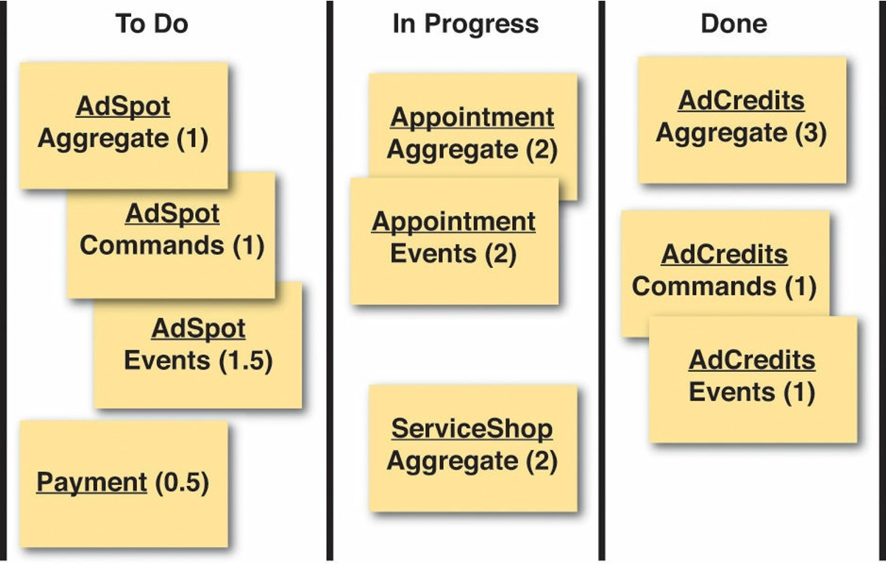  

现在，你已经有了对每个组成部分类型的估计，你可以直接根据这些组成部分来确定你的任务。你可以选择将每个组件作为一个单一的任务，并标明小时数或其分数，或者你可以选择将你的任务进一步细分。然而，我建议小心地将任务分解得太细，以免使任务板过于复杂。如前所述，最好是把一个聚合体所使用的所有命令和所有领域事件合并为一个任务。
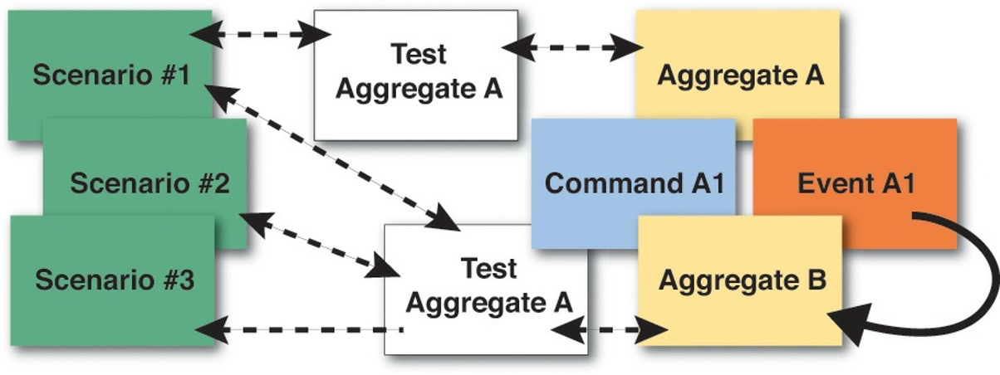  

### 如何实施 

即使是通过事件风暴法确定的工件，你也不一定拥有在特定领域场景、故事和用例工作所需的所有知识。如果需要更多的知识，一定要在你的估计中包括进一步获取知识的时间。但什么时间呢？回顾一下，在第二章我向你介绍了围绕你的领域模型创建具体场景的方法。这可能是获取核心领域知识的最好方法之一，超出了你从Event Storming中所能得到的。具体场景和事件风暴是两个应该一起使用的工具。下面是它的工作原理。 

- 进行一次快速的 "事件风暴"（Event Storming），也许只需要一个小时左右的时间。你几乎肯定会发现，你需要围绕你的一些快速建模发现开发更具体的场景。 

- 与领域专家合作，讨论一个或多个需要完善的具体方案。这确定了软件模型将如何被使用。同样，这些不只是程序，而应该以确定实际的领域模型元素（如对象），元素如何协作，以及它们如何与用户交互为目标来陈述。(根据需要参考第二章)。 

- 创建一套验收测试（或可执行规范），以锻炼每个场景的能力。(根据需要参考第二章)。 

- 创建组件以允许测试/规范的执行。当你完善测试/规范和组件时，要进行迭代（简短而快速），直到它们做到领域专家所期望的。 

- 很有可能一些迭代（简短而快速）会使你考虑其他场景，创建额外的测试/规范，并完善现有的和创建新的组件。继续这样做，直到你获得了所有必要的知识来满足有限的商业目标，或者直到你的时间框架到期。如果你还没有达到预期的目标，请确保产生建模债务，以便在（最好是近期）的将来解决这个问题。 

然而，你需要领域专家提供多少时间？

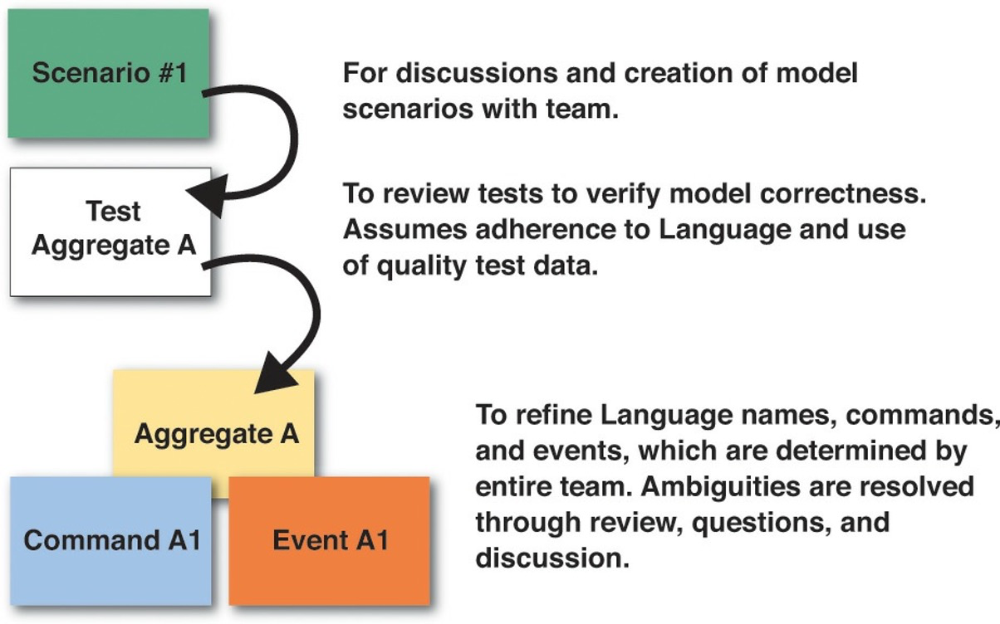  

### 与领域专家互动 

采用DDD的主要挑战之一是如何获得与领域专家相处的时间，而且不能过度。很多时候，项目中的领域专家会有很多其他的责任，要开很多小时的会议，还可能要出差。由于他们可能不在建模环境中，因此很难找到足够的时间与他们相处。因此，我们最好让我们使用的时间有价值，并将其限制在必要的范围内。除非你让建模会议变得有趣和高效，否则你很有可能在错误的时间失去他们的帮助。如果他们觉得有价值、有启迪、有收获，你就有可能建立起你所需要的强有力的伙伴关系。 

因此，首先要回答的问题是："我们什么时候需要与领域专家相处？他们需要帮助我们执行什么任务？" 

- 始终让领域专家参与事件风暴活动。开发人员总是有很多问题，而领域专家会有答案。请确保他们一起参加事件风暴会议。 

- 你将需要领域专家对讨论和创建模型情景的投入。例子见第二章。 

- 将需要领域专家来审查测试以验证模型的正确性。这假定开发人员已经认真努力地遵守泛在语言，并使用高质量的、真实的测试数据。 

- 你将需要领域专家来完善泛在语言及其聚合名称、命令和领域事件，这些都是由整个团队决定的。通过审查、提问和讨论来解决含糊不清的问题。即便如此，事件风暴会议应该已经解决了关于泛在语言的大部分问题。

那么，现在你知道你将需要领域专家提供什么，你应该要求他们为每项责任提供多少时间？ 

- 事件风暴会议应该限制在每场几个小时（两到三个小时）。你可能需要在连续的几天内举行会议，如三或四天。 

- 挤出大量的时间来讨论和完善方案，但要尽量延长每个方案的时间。你应该能够在10到20分钟的时间内讨论和迭代一个方案。 

- 对于测试，你将需要一些时间与领域专家一起审查你所写的东西。但不要指望他们在你写代码时坐在那里。也许他们会，那是一种奖励，但不要指望它。准确的模型需要更少的时间来审查和验证。不要低估领域专家在你的帮助下通读测试的能力。他们可以做到这一点，特别是如果测试数据是现实的。你的测试应该允许领域专家在每一到两分钟左右理解和验证一个测试，或者差不多。 

- 在测试审查期间，领域专家可以提供关于聚合、命令和领域事件以及其他工件的意见，以确定它们如何遵守泛在语言。这可以在很短的时间内完成。 

这一指导应有助于你对域名专家使用恰到好处的时间，并限制你需要与他们相处的时间。 

### 摘要 

综上所述，在本章中你学到了。 

- 关于事件风暴，如何使用它，以及如何与你的团队一起执行会议，所有这些都是为了加速你的建模工作。 
- 关于其他可以与事件风暴一起使用的工具 
- 如何在项目中使用DDD，以及如何管理估算和你需要的领域专家的时间 

关于涵盖DDD在项目上的实施的详尽参考资料，请参见《实施领域驱动设计》\[IDDD\] 。